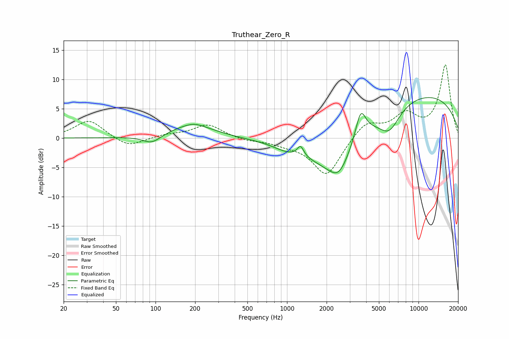

# Truthear_Zero_R
See [usage instructions](https://github.com/jaakkopasanen/AutoEq#usage) for more options and info.

### Parametric EQs
Apply preamp of -7.0 dB when using parametric equalizer.

|   # | Type    |   Fc (Hz) |    Q |   Gain (dB) |
|-----|---------|-----------|------|-------------|
|   1 | Peaking |        94 | 2.08 |        -1.5 |
|   2 | Peaking |       191 | 0.85 |         2.3 |
|   3 | Peaking |       196 | 2.69 |         0.3 |
|   4 | Peaking |       976 | 1.53 |        -0.7 |
|   5 | Peaking |      1267 | 5.91 |         1.7 |
|   6 | Peaking |      2255 | 0.62 |        -8.4 |
|   7 | Peaking |      2486 | 2.02 |        -3.1 |
|   8 | Peaking |      3635 | 3.58 |         4.9 |
|   9 | Peaking |      5996 | 1.69 |        -4.1 |
|  10 | Peaking |      8204 | 0.2  |         8.2 |

### Fixed Band EQs
When using fixed band (also called graphic) equalizer, apply preamp of **-12.6 dB** (if available) and set gains manually with these parameters.

|   # | Type    |   Fc (Hz) |    Q |   Gain (dB) |
|-----|---------|-----------|------|-------------|
|   1 | Peaking |        31 | 1.41 |         3.1 |
|   2 | Peaking |        62 | 1.41 |        -1.7 |
|   3 | Peaking |       125 | 1.41 |         0.5 |
|   4 | Peaking |       250 | 1.41 |         2.3 |
|   5 | Peaking |       500 | 1.41 |        -0.4 |
|   6 | Peaking |      1000 | 1.41 |        -0.8 |
|   7 | Peaking |      2000 | 1.41 |        -6.5 |
|   8 | Peaking |      4000 | 1.41 |         2.8 |
|   9 | Peaking |      8000 | 1.41 |         3.7 |
|  10 | Peaking |     16000 | 1.41 |        12.4 |

### Graphs

