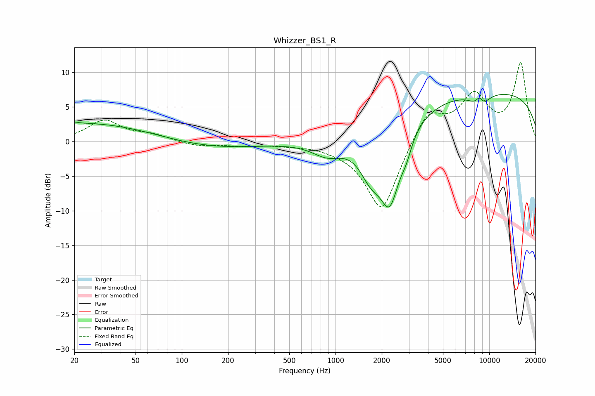

# Whizzer_BS1_R
See [usage instructions](https://github.com/jaakkopasanen/AutoEq#usage) for more options and info.

### Parametric EQs
Apply preamp of -6.9 dB when using parametric equalizer.

|   # | Type    |   Fc (Hz) |    Q |   Gain (dB) |
|-----|---------|-----------|------|-------------|
|   1 | Peaking |        20 | 5.72 |         0.2 |
|   2 | Peaking |        25 | 0.29 |         2.8 |
|   3 | Peaking |       136 | 0.42 |        -1.3 |
|   4 | Peaking |       888 | 1.38 |        -2.2 |
|   5 | Peaking |      1693 | 1.87 |        -4.6 |
|   6 | Peaking |      2258 | 1.98 |       -10.7 |
|   7 | Peaking |      2883 | 3.87 |        -1.9 |
|   8 | Peaking |      8640 | 4.36 |         3.6 |
|   9 | Peaking |      8680 | 2.97 |        -4.3 |
|  10 | Peaking |      9579 | 0.18 |         7.3 |

### Fixed Band EQs
When using fixed band (also called graphic) equalizer, apply preamp of **-11.5 dB** (if available) and set gains manually with these parameters.

|   # | Type    |   Fc (Hz) |    Q |   Gain (dB) |
|-----|---------|-----------|------|-------------|
|   1 | Peaking |        31 | 1.41 |         3   |
|   2 | Peaking |        62 | 1.41 |         0.9 |
|   3 | Peaking |       125 | 1.41 |        -0.6 |
|   4 | Peaking |       250 | 1.41 |        -0.6 |
|   5 | Peaking |       500 | 1.41 |        -0.3 |
|   6 | Peaking |      1000 | 1.41 |        -0.4 |
|   7 | Peaking |      2000 | 1.41 |       -10.3 |
|   8 | Peaking |      4000 | 1.41 |         4.7 |
|   9 | Peaking |      8000 | 1.41 |         6.2 |
|  10 | Peaking |     16000 | 1.41 |        11.1 |

### Graphs

