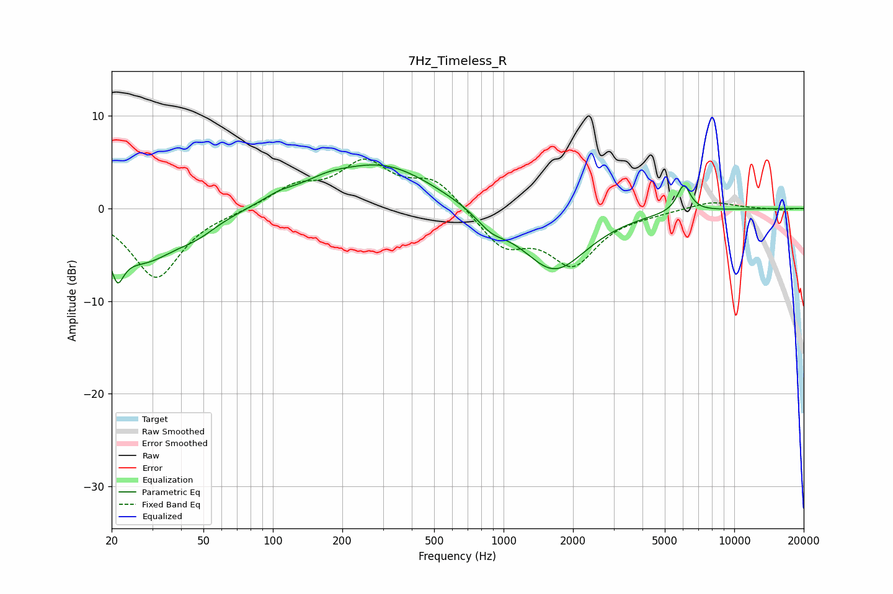

# 7Hz_Timeless_R
See [usage instructions](https://github.com/jaakkopasanen/AutoEq#usage) for more options and info.

### Parametric EQs
Apply preamp of -4.8 dB when using parametric equalizer.

|   # | Type    |   Fc (Hz) |    Q |   Gain (dB) |
|-----|---------|-----------|------|-------------|
|   1 | Peaking |        21 | 5.39 |        -7   |
|   2 | Peaking |        21 | 5.91 |         3.3 |
|   3 | Peaking |        28 | 0.93 |        -5.3 |
|   4 | Peaking |        47 | 1.62 |        -1.2 |
|   5 | Peaking |       107 | 1.88 |         0.8 |
|   6 | Peaking |       170 | 1.39 |         1   |
|   7 | Peaking |       300 | 0.63 |         4.7 |
|   8 | Peaking |       883 | 2.18 |        -1.5 |
|   9 | Peaking |      1656 | 0.98 |        -6.8 |
|  10 | Peaking |      6043 | 4.74 |         3   |

### Fixed Band EQs
When using fixed band (also called graphic) equalizer, apply preamp of **-5.4 dB** (if available) and set gains manually with these parameters.

|   # | Type    |   Fc (Hz) |    Q |   Gain (dB) |
|-----|---------|-----------|------|-------------|
|   1 | Peaking |        31 | 1.41 |        -7.5 |
|   2 | Peaking |        62 | 1.41 |        -0.2 |
|   3 | Peaking |       125 | 1.41 |         2.2 |
|   4 | Peaking |       250 | 1.41 |         4.6 |
|   5 | Peaking |       500 | 1.41 |         3   |
|   6 | Peaking |      1000 | 1.41 |        -3.9 |
|   7 | Peaking |      2000 | 1.41 |        -5.7 |
|   8 | Peaking |      4000 | 1.41 |        -0.3 |
|   9 | Peaking |      8000 | 1.41 |         0.8 |
|  10 | Peaking |     16000 | 1.41 |        -0.1 |

### Graphs

