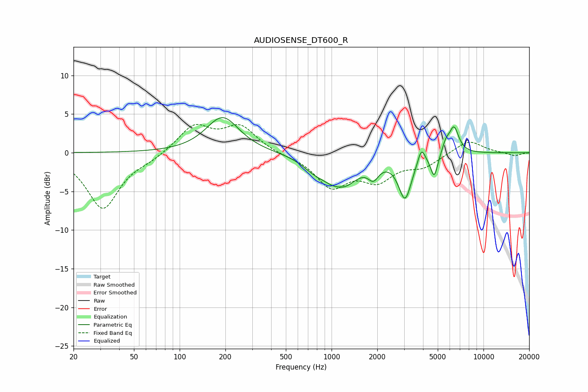

# AUDIOSENSE_DT600_R
See [usage instructions](https://github.com/jaakkopasanen/AutoEq#usage) for more options and info.

### Parametric EQs
Apply preamp of -4.6 dB when using parametric equalizer.

|   # | Type    |   Fc (Hz) |    Q |   Gain (dB) |
|-----|---------|-----------|------|-------------|
|   1 | Peaking |       192 | 1.31 |         4.6 |
|   2 | Peaking |       766 | 1.74 |        -1.1 |
|   3 | Peaking |      1126 | 3.04 |         0.6 |
|   4 | Peaking |      1144 | 1.4  |        -4.5 |
|   5 | Peaking |      1887 | 4.05 |        -1.8 |
|   6 | Peaking |      3047 | 3.27 |        -5.5 |
|   7 | Peaking |      3905 | 6    |         2   |
|   8 | Peaking |      4741 | 5.93 |        -3   |
|   9 | Peaking |      5640 | 6    |         1.2 |
|  10 | Peaking |      6389 | 4.25 |         3.4 |

### Fixed Band EQs
When using fixed band (also called graphic) equalizer, apply preamp of **-3.8 dB** (if available) and set gains manually with these parameters.

|   # | Type    |   Fc (Hz) |    Q |   Gain (dB) |
|-----|---------|-----------|------|-------------|
|   1 | Peaking |        31 | 1.41 |        -7.2 |
|   2 | Peaking |        62 | 1.41 |        -0.7 |
|   3 | Peaking |       125 | 1.41 |         3.4 |
|   4 | Peaking |       250 | 1.41 |         3.3 |
|   5 | Peaking |       500 | 1.41 |        -0.2 |
|   6 | Peaking |      1000 | 1.41 |        -4.2 |
|   7 | Peaking |      2000 | 1.41 |        -3.2 |
|   8 | Peaking |      4000 | 1.41 |        -1.6 |
|   9 | Peaking |      8000 | 1.41 |         1.7 |
|  10 | Peaking |     16000 | 1.41 |        -0.4 |

### Graphs

