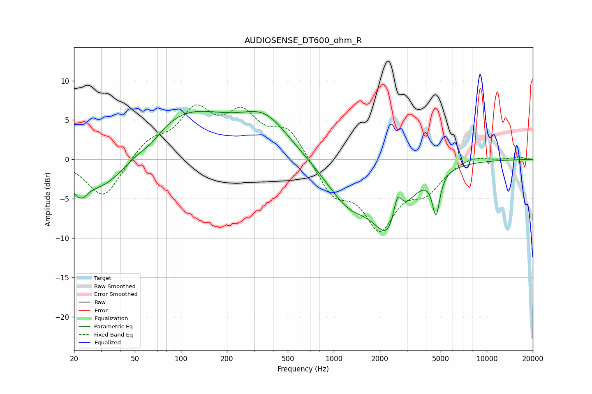

# AUDIOSENSE_DT600_ohm_R
See [usage instructions](https://github.com/jaakkopasanen/AutoEq#usage) for more options and info.

### Parametric EQs
Apply preamp of -6.2 dB when using parametric equalizer.

|   # | Type    |   Fc (Hz) |    Q |   Gain (dB) |
|-----|---------|-----------|------|-------------|
|   1 | Peaking |        22 | 4.6  |        -5.3 |
|   2 | Peaking |        22 | 5.93 |         3.2 |
|   3 | Peaking |        31 | 0.7  |        -5.2 |
|   4 | Peaking |        64 | 2.02 |        -1   |
|   5 | Peaking |       103 | 0.46 |         6.4 |
|   6 | Peaking |       357 | 0.89 |         4.3 |
|   7 | Peaking |      1244 | 0.95 |        -4.9 |
|   8 | Peaking |      2333 | 1.32 |        -8.3 |
|   9 | Peaking |      2605 | 4.82 |         4   |
|  10 | Peaking |      4660 | 5.8  |        -5.1 |

### Fixed Band EQs
When using fixed band (also called graphic) equalizer, apply preamp of **-7.0 dB** (if available) and set gains manually with these parameters.

|   # | Type    |   Fc (Hz) |    Q |   Gain (dB) |
|-----|---------|-----------|------|-------------|
|   1 | Peaking |        31 | 1.41 |        -5.1 |
|   2 | Peaking |        62 | 1.41 |         2.3 |
|   3 | Peaking |       125 | 1.41 |         5.7 |
|   4 | Peaking |       250 | 1.41 |         5   |
|   5 | Peaking |       500 | 1.41 |         3.7 |
|   6 | Peaking |      1000 | 1.41 |        -4.1 |
|   7 | Peaking |      2000 | 1.41 |        -8.1 |
|   8 | Peaking |      4000 | 1.41 |        -3.3 |
|   9 | Peaking |      8000 | 1.41 |         0.7 |
|  10 | Peaking |     16000 | 1.41 |         0.3 |

### Graphs

