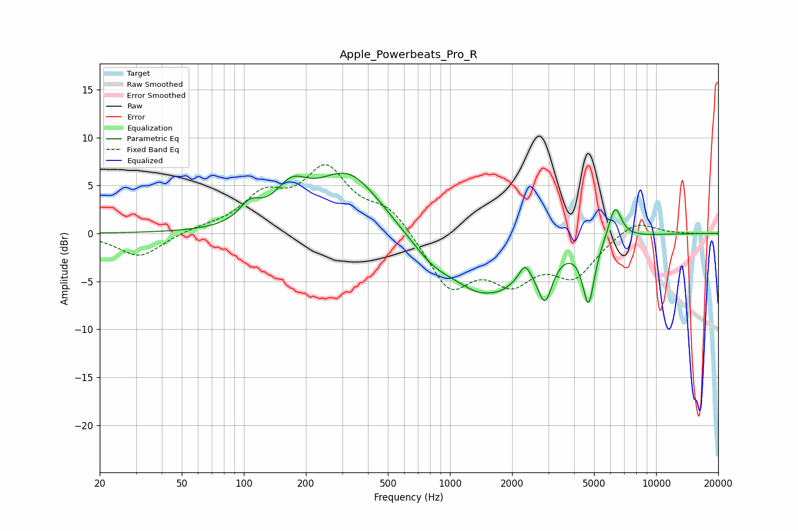

# Apple_Powerbeats_Pro_R
See [usage instructions](https://github.com/jaakkopasanen/AutoEq#usage) for more options and info.

### Parametric EQs
Apply preamp of -6.4 dB when using parametric equalizer.

|   # | Type    |   Fc (Hz) |    Q |   Gain (dB) |
|-----|---------|-----------|------|-------------|
|   1 | Peaking |       107 | 2.76 |         1.8 |
|   2 | Peaking |       170 | 1.82 |         3.2 |
|   3 | Peaking |       321 | 0.88 |         6.3 |
|   4 | Peaking |       829 | 1.26 |        -2.2 |
|   5 | Peaking |      1545 | 2.2  |         0.9 |
|   6 | Peaking |      1550 | 0.94 |        -6.8 |
|   7 | Peaking |      2309 | 5.31 |         1.6 |
|   8 | Peaking |      2890 | 3.99 |        -4.5 |
|   9 | Peaking |      4701 | 4.85 |        -6.5 |
|  10 | Peaking |      6318 | 4.32 |         3.6 |

### Fixed Band EQs
When using fixed band (also called graphic) equalizer, apply preamp of **-7.3 dB** (if available) and set gains manually with these parameters.

|   # | Type    |   Fc (Hz) |    Q |   Gain (dB) |
|-----|---------|-----------|------|-------------|
|   1 | Peaking |        31 | 1.41 |        -2.5 |
|   2 | Peaking |        62 | 1.41 |         0.4 |
|   3 | Peaking |       125 | 1.41 |         3.5 |
|   4 | Peaking |       250 | 1.41 |         6.3 |
|   5 | Peaking |       500 | 1.41 |         2.5 |
|   6 | Peaking |      1000 | 1.41 |        -5.6 |
|   7 | Peaking |      2000 | 1.41 |        -4.2 |
|   8 | Peaking |      4000 | 1.41 |        -4.1 |
|   9 | Peaking |      8000 | 1.41 |         1.5 |
|  10 | Peaking |     16000 | 1.41 |        -0   |

### Graphs

