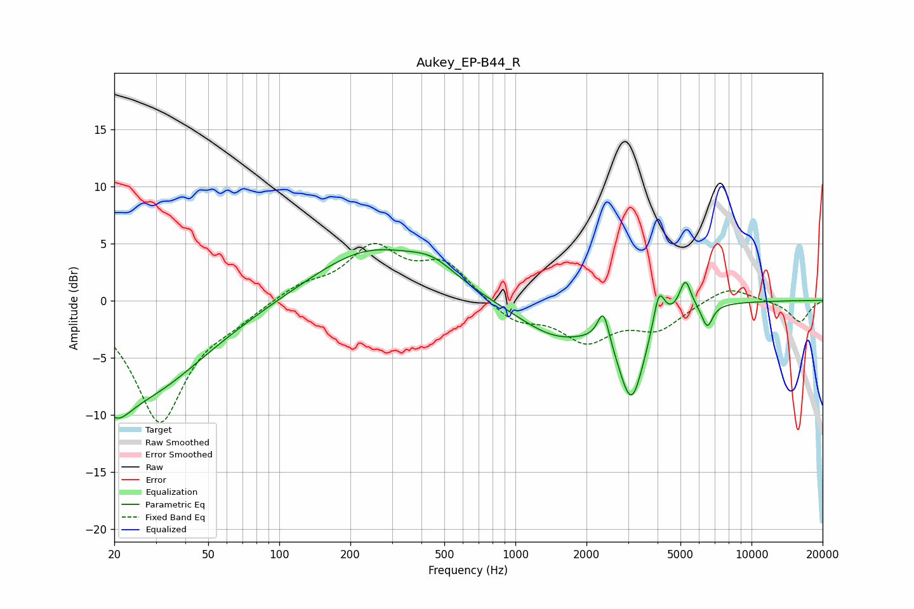

# Aukey_EP-B44_R
See [usage instructions](https://github.com/jaakkopasanen/AutoEq#usage) for more options and info.

### Parametric EQs
Apply preamp of -4.5 dB when using parametric equalizer.

|   # | Type    |   Fc (Hz) |    Q |   Gain (dB) |
|-----|---------|-----------|------|-------------|
|   1 | Peaking |        20 | 2.08 |        -3.5 |
|   2 | Peaking |        27 | 0.54 |        -7.6 |
|   3 | Peaking |       241 | 0.58 |         4.5 |
|   4 | Peaking |       448 | 1.41 |         1.5 |
|   5 | Peaking |      1505 | 0.82 |        -3.1 |
|   6 | Peaking |      2360 | 5.84 |         2.9 |
|   7 | Peaking |      3102 | 2.54 |        -7.8 |
|   8 | Peaking |      4055 | 5.88 |         3.3 |
|   9 | Peaking |      5244 | 5.68 |         2.7 |
|  10 | Peaking |      6495 | 6    |        -2   |

### Fixed Band EQs
When using fixed band (also called graphic) equalizer, apply preamp of **-5.1 dB** (if available) and set gains manually with these parameters.

|   # | Type    |   Fc (Hz) |    Q |   Gain (dB) |
|-----|---------|-----------|------|-------------|
|   1 | Peaking |        31 | 1.41 |       -10.6 |
|   2 | Peaking |        62 | 1.41 |        -1.1 |
|   3 | Peaking |       125 | 1.41 |         1.3 |
|   4 | Peaking |       250 | 1.41 |         4.4 |
|   5 | Peaking |       500 | 1.41 |         3.1 |
|   6 | Peaking |      1000 | 1.41 |        -1.8 |
|   7 | Peaking |      2000 | 1.41 |        -3.3 |
|   8 | Peaking |      4000 | 1.41 |        -2.3 |
|   9 | Peaking |      8000 | 1.41 |         1.3 |
|  10 | Peaking |     16000 | 1.41 |        -1.9 |

### Graphs

