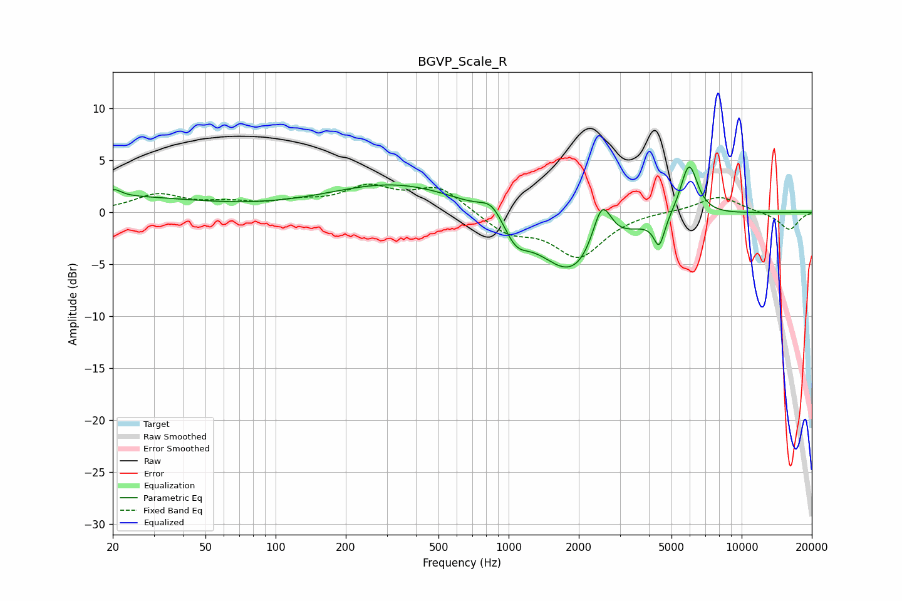

# BGVP_Scale_R
See [usage instructions](https://github.com/jaakkopasanen/AutoEq#usage) for more options and info.

### Parametric EQs
Apply preamp of -4.5 dB when using parametric equalizer.

|   # | Type    |   Fc (Hz) |    Q |   Gain (dB) |
|-----|---------|-----------|------|-------------|
|   1 | Peaking |        20 | 0.4  |         1.5 |
|   2 | Peaking |        20 | 4.75 |         0.7 |
|   3 | Peaking |       332 | 0.49 |         2.8 |
|   4 | Peaking |       848 | 2.81 |         1.6 |
|   5 | Peaking |      1073 | 2.62 |        -2.1 |
|   6 | Peaking |      1858 | 1.18 |        -0.8 |
|   7 | Peaking |      1904 | 0.93 |        -5.5 |
|   8 | Peaking |      2512 | 3.37 |         4.8 |
|   9 | Peaking |      4428 | 6    |        -2.8 |
|  10 | Peaking |      5945 | 3.75 |         5.1 |

### Fixed Band EQs
When using fixed band (also called graphic) equalizer, apply preamp of **-2.8 dB** (if available) and set gains manually with these parameters.

|   # | Type    |   Fc (Hz) |    Q |   Gain (dB) |
|-----|---------|-----------|------|-------------|
|   1 | Peaking |        31 | 1.41 |         1.6 |
|   2 | Peaking |        62 | 1.41 |         0.7 |
|   3 | Peaking |       125 | 1.41 |         0.8 |
|   4 | Peaking |       250 | 1.41 |         2.2 |
|   5 | Peaking |       500 | 1.41 |         2.4 |
|   6 | Peaking |      1000 | 1.41 |        -1.9 |
|   7 | Peaking |      2000 | 1.41 |        -4.2 |
|   8 | Peaking |      4000 | 1.41 |         0.1 |
|   9 | Peaking |      8000 | 1.41 |         1.6 |
|  10 | Peaking |     16000 | 1.41 |        -1.7 |

### Graphs

