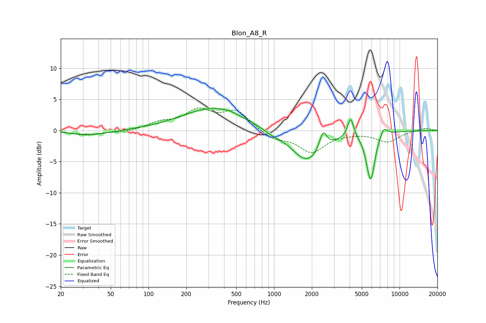

# Blon_A8_R
See [usage instructions](https://github.com/jaakkopasanen/AutoEq#usage) for more options and info.

### Parametric EQs
Apply preamp of -3.6 dB when using parametric equalizer.

|   # | Type    |   Fc (Hz) |    Q |   Gain (dB) |
|-----|---------|-----------|------|-------------|
|   1 | Peaking |        35 | 0.96 |        -0.8 |
|   2 | Peaking |       324 | 0.57 |         3.6 |
|   3 | Peaking |       441 | 2.11 |         0.3 |
|   4 | Peaking |       972 | 2.29 |        -0.5 |
|   5 | Peaking |      1844 | 1.11 |        -5.1 |
|   6 | Peaking |      2454 | 4.98 |         2.9 |
|   7 | Peaking |      4073 | 5.97 |         3.2 |
|   8 | Peaking |      5555 | 4.99 |        -0.9 |
|   9 | Peaking |      5909 | 4.27 |        -7.1 |
|  10 | Peaking |      7466 | 4.77 |         1.4 |

### Fixed Band EQs
When using fixed band (also called graphic) equalizer, apply preamp of **-3.7 dB** (if available) and set gains manually with these parameters.

|   # | Type    |   Fc (Hz) |    Q |   Gain (dB) |
|-----|---------|-----------|------|-------------|
|   1 | Peaking |        31 | 1.41 |        -0.7 |
|   2 | Peaking |        62 | 1.41 |        -0.3 |
|   3 | Peaking |       125 | 1.41 |         1.1 |
|   4 | Peaking |       250 | 1.41 |         3   |
|   5 | Peaking |       500 | 1.41 |         3   |
|   6 | Peaking |      1000 | 1.41 |        -1.3 |
|   7 | Peaking |      2000 | 1.41 |        -3.3 |
|   8 | Peaking |      4000 | 1.41 |        -0.2 |
|   9 | Peaking |      8000 | 1.41 |        -1.7 |
|  10 | Peaking |     16000 | 1.41 |         0.4 |

### Graphs

