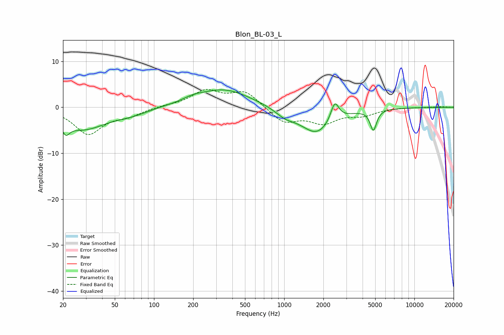

# Blon_BL-03_L
See [usage instructions](https://github.com/jaakkopasanen/AutoEq#usage) for more options and info.

### Parametric EQs
Apply preamp of -3.9 dB when using parametric equalizer.

|   # | Type    |   Fc (Hz) |    Q |   Gain (dB) |
|-----|---------|-----------|------|-------------|
|   1 | Peaking |        21 | 5.45 |        -5.6 |
|   2 | Peaking |        21 | 5.73 |         3.3 |
|   3 | Peaking |        28 | 0.77 |        -4.6 |
|   4 | Peaking |        68 | 1.13 |        -1   |
|   5 | Peaking |       200 | 1.89 |         0.7 |
|   6 | Peaking |       344 | 0.69 |         4   |
|   7 | Peaking |      1018 | 1.88 |        -1.5 |
|   8 | Peaking |      1776 | 1.14 |        -5.7 |
|   9 | Peaking |      2446 | 4.47 |         4.3 |
|  10 | Peaking |      4839 | 5.8  |        -4.5 |

### Fixed Band EQs
When using fixed band (also called graphic) equalizer, apply preamp of **-4.0 dB** (if available) and set gains manually with these parameters.

|   # | Type    |   Fc (Hz) |    Q |   Gain (dB) |
|-----|---------|-----------|------|-------------|
|   1 | Peaking |        31 | 1.41 |        -5.7 |
|   2 | Peaking |        62 | 1.41 |        -1.5 |
|   3 | Peaking |       125 | 1.41 |         0.3 |
|   4 | Peaking |       250 | 1.41 |         3.4 |
|   5 | Peaking |       500 | 1.41 |         3.4 |
|   6 | Peaking |      1000 | 1.41 |        -3.3 |
|   7 | Peaking |      2000 | 1.41 |        -3.1 |
|   8 | Peaking |      4000 | 1.41 |        -1.5 |
|   9 | Peaking |      8000 | 1.41 |         0   |
|  10 | Peaking |     16000 | 1.41 |         0.1 |

### Graphs

