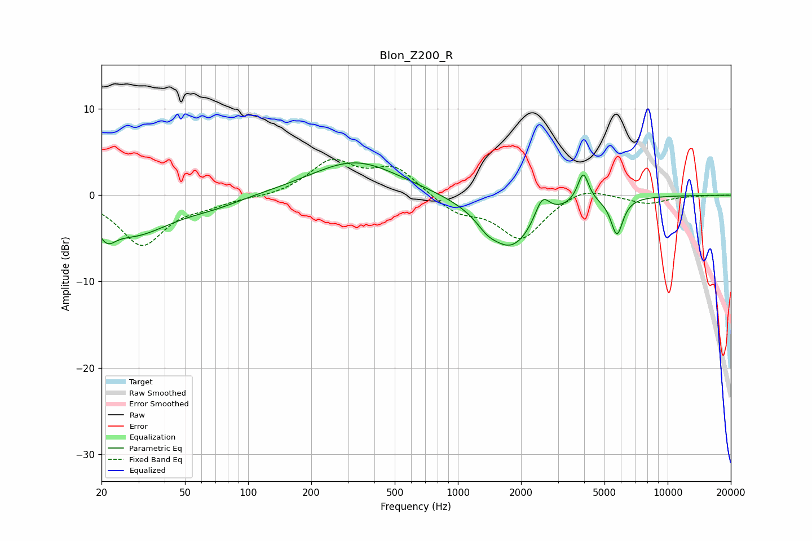

# Blon_Z200_R
See [usage instructions](https://github.com/jaakkopasanen/AutoEq#usage) for more options and info.

### Parametric EQs
Apply preamp of -3.8 dB when using parametric equalizer.

|   # | Type    |   Fc (Hz) |    Q |   Gain (dB) |
|-----|---------|-----------|------|-------------|
|   1 | Peaking |        21 | 5.16 |        -4.9 |
|   2 | Peaking |        21 | 5.98 |         3.2 |
|   3 | Peaking |        28 | 0.75 |        -4.5 |
|   4 | Peaking |        70 | 1.05 |        -0.8 |
|   5 | Peaking |       324 | 0.67 |         4   |
|   6 | Peaking |      1375 | 3.19 |        -0.9 |
|   7 | Peaking |      1791 | 1.17 |        -6.2 |
|   8 | Peaking |      2525 | 3.98 |         2.8 |
|   9 | Peaking |      3957 | 5.35 |         3.6 |
|  10 | Peaking |      5731 | 4.9  |        -4.3 |

### Fixed Band EQs
When using fixed band (also called graphic) equalizer, apply preamp of **-4.3 dB** (if available) and set gains manually with these parameters.

|   # | Type    |   Fc (Hz) |    Q |   Gain (dB) |
|-----|---------|-----------|------|-------------|
|   1 | Peaking |        31 | 1.41 |        -5.7 |
|   2 | Peaking |        62 | 1.41 |        -0.9 |
|   3 | Peaking |       125 | 1.41 |        -0.2 |
|   4 | Peaking |       250 | 1.41 |         3.8 |
|   5 | Peaking |       500 | 1.41 |         3.1 |
|   6 | Peaking |      1000 | 1.41 |        -1.9 |
|   7 | Peaking |      2000 | 1.41 |        -5   |
|   8 | Peaking |      4000 | 1.41 |         1.2 |
|   9 | Peaking |      8000 | 1.41 |        -1   |
|  10 | Peaking |     16000 | 1.41 |        -0   |

### Graphs

