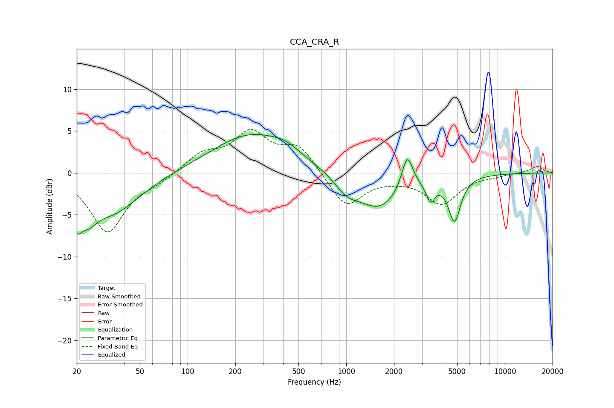

# CCA_CRA_R
See [usage instructions](https://github.com/jaakkopasanen/AutoEq#usage) for more options and info.

### Parametric EQs
Apply preamp of -4.7 dB when using parametric equalizer.

|   # | Type    |   Fc (Hz) |    Q |   Gain (dB) |
|-----|---------|-----------|------|-------------|
|   1 | Peaking |        20 | 4.41 |        -3.3 |
|   2 | Peaking |        24 | 2.72 |        -2.2 |
|   3 | Peaking |        33 | 0.8  |        -4.7 |
|   4 | Peaking |       251 | 0.58 |         4.6 |
|   5 | Peaking |       417 | 1.6  |         0.9 |
|   6 | Peaking |      1003 | 2    |        -1.6 |
|   7 | Peaking |      1605 | 1    |        -4.2 |
|   8 | Peaking |      2425 | 3.98 |         4.3 |
|   9 | Peaking |      3401 | 5.21 |        -2.2 |
|  10 | Peaking |      4813 | 3.61 |        -5.3 |

### Fixed Band EQs
When using fixed band (also called graphic) equalizer, apply preamp of **-5.3 dB** (if available) and set gains manually with these parameters.

|   # | Type    |   Fc (Hz) |    Q |   Gain (dB) |
|-----|---------|-----------|------|-------------|
|   1 | Peaking |        31 | 1.41 |        -7   |
|   2 | Peaking |        62 | 1.41 |        -0.8 |
|   3 | Peaking |       125 | 1.41 |         2.2 |
|   4 | Peaking |       250 | 1.41 |         4.5 |
|   5 | Peaking |       500 | 1.41 |         3.1 |
|   6 | Peaking |      1000 | 1.41 |        -4.2 |
|   7 | Peaking |      2000 | 1.41 |        -0.4 |
|   8 | Peaking |      4000 | 1.41 |        -3.6 |
|   9 | Peaking |      8000 | 1.41 |        -0.2 |
|  10 | Peaking |     16000 | 1.41 |         0.8 |

### Graphs

