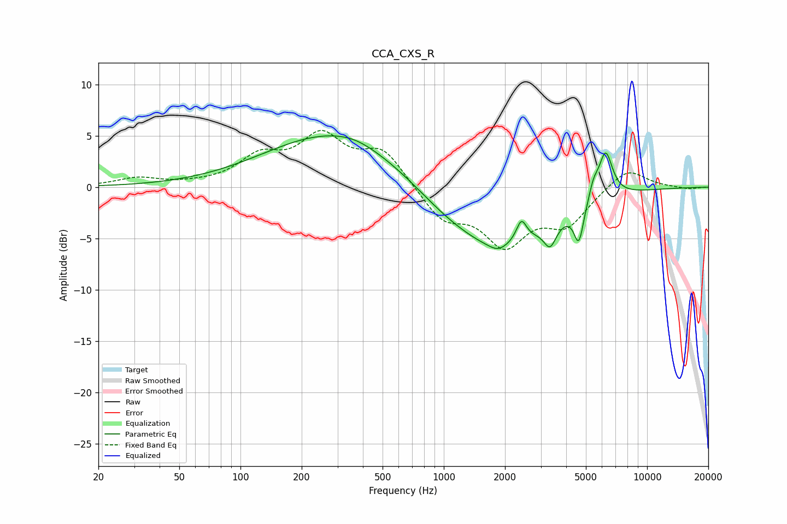

# CCA_CXS_R
See [usage instructions](https://github.com/jaakkopasanen/AutoEq#usage) for more options and info.

### Parametric EQs
Apply preamp of -5.1 dB when using parametric equalizer.

|   # | Type    |   Fc (Hz) |    Q |   Gain (dB) |
|-----|---------|-----------|------|-------------|
|   1 | Peaking |       292 | 0.42 |         5.3 |
|   2 | Peaking |       362 | 1.53 |         0.3 |
|   3 | Peaking |       969 | 0.94 |        -0.7 |
|   4 | Peaking |      1832 | 0.57 |        -6   |
|   5 | Peaking |      1842 | 3.47 |        -0.5 |
|   6 | Peaking |      2408 | 5.57 |         2.1 |
|   7 | Peaking |      3335 | 4.56 |        -2.2 |
|   8 | Peaking |      4618 | 5.93 |        -3.6 |
|   9 | Peaking |      5449 | 6    |         1.4 |
|  10 | Peaking |      6249 | 3.99 |         4.6 |

### Fixed Band EQs
When using fixed band (also called graphic) equalizer, apply preamp of **-5.6 dB** (if available) and set gains manually with these parameters.

|   # | Type    |   Fc (Hz) |    Q |   Gain (dB) |
|-----|---------|-----------|------|-------------|
|   1 | Peaking |        31 | 1.41 |         0.8 |
|   2 | Peaking |        62 | 1.41 |         0.1 |
|   3 | Peaking |       125 | 1.41 |         2.6 |
|   4 | Peaking |       250 | 1.41 |         4.5 |
|   5 | Peaking |       500 | 1.41 |         3.4 |
|   6 | Peaking |      1000 | 1.41 |        -3   |
|   7 | Peaking |      2000 | 1.41 |        -5.2 |
|   8 | Peaking |      4000 | 1.41 |        -3.3 |
|   9 | Peaking |      8000 | 1.41 |         2   |
|  10 | Peaking |     16000 | 1.41 |        -0.2 |

### Graphs

