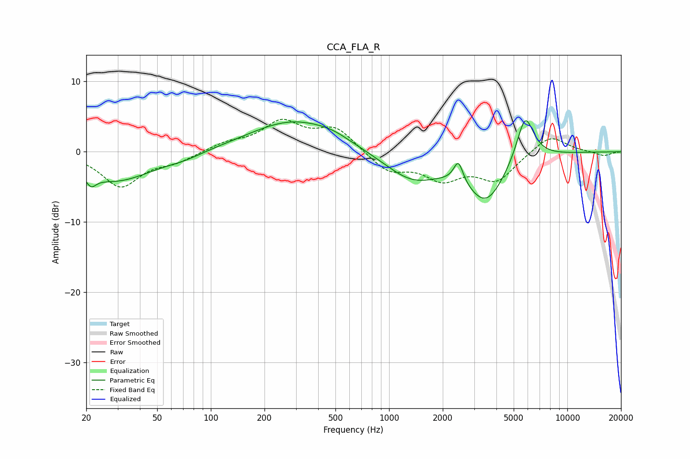

# CCA_FLA_R
See [usage instructions](https://github.com/jaakkopasanen/AutoEq#usage) for more options and info.

### Parametric EQs
Apply preamp of -4.5 dB when using parametric equalizer.

|   # | Type    |   Fc (Hz) |    Q |   Gain (dB) |
|-----|---------|-----------|------|-------------|
|   1 | Peaking |        21 | 5.69 |        -4.7 |
|   2 | Peaking |        21 | 6    |         3.2 |
|   3 | Peaking |        29 | 0.67 |        -4.1 |
|   4 | Peaking |        72 | 1.39 |        -0.6 |
|   5 | Peaking |       291 | 0.57 |         4.5 |
|   6 | Peaking |       478 | 1.51 |         0.6 |
|   7 | Peaking |      1346 | 0.88 |        -3.9 |
|   8 | Peaking |      2448 | 5.42 |         3.1 |
|   9 | Peaking |      3505 | 1.28 |        -6.7 |
|  10 | Peaking |      5795 | 2.8  |         6.8 |

### Fixed Band EQs
When using fixed band (also called graphic) equalizer, apply preamp of **-4.7 dB** (if available) and set gains manually with these parameters.

|   # | Type    |   Fc (Hz) |    Q |   Gain (dB) |
|-----|---------|-----------|------|-------------|
|   1 | Peaking |        31 | 1.41 |        -4.9 |
|   2 | Peaking |        62 | 1.41 |        -1.2 |
|   3 | Peaking |       125 | 1.41 |         1.1 |
|   4 | Peaking |       250 | 1.41 |         4   |
|   5 | Peaking |       500 | 1.41 |         3.3 |
|   6 | Peaking |      1000 | 1.41 |        -2.7 |
|   7 | Peaking |      2000 | 1.41 |        -3.5 |
|   8 | Peaking |      4000 | 1.41 |        -3.9 |
|   9 | Peaking |      8000 | 1.41 |         2.5 |
|  10 | Peaking |     16000 | 1.41 |        -0.6 |

### Graphs

