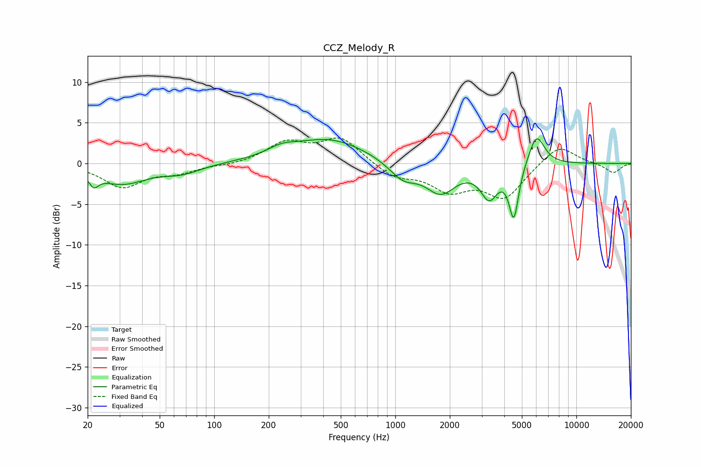

# CCZ_Melody_R
See [usage instructions](https://github.com/jaakkopasanen/AutoEq#usage) for more options and info.

### Parametric EQs
Apply preamp of -3.1 dB when using parametric equalizer.

|   # | Type    |   Fc (Hz) |    Q |   Gain (dB) |
|-----|---------|-----------|------|-------------|
|   1 | Peaking |        22 | 5.54 |        -1.4 |
|   2 | Peaking |        31 | 1.03 |        -2.4 |
|   3 | Peaking |        66 | 1.36 |        -1   |
|   4 | Peaking |       236 | 1.82 |         0.9 |
|   5 | Peaking |       431 | 0.68 |         3   |
|   6 | Peaking |      1103 | 1.82 |        -2.1 |
|   7 | Peaking |      1782 | 1.71 |        -3.5 |
|   8 | Peaking |      3302 | 3    |        -3.8 |
|   9 | Peaking |      4515 | 5.27 |        -6.5 |
|  10 | Peaking |      6024 | 3.12 |         3.9 |

### Fixed Band EQs
When using fixed band (also called graphic) equalizer, apply preamp of **-3.2 dB** (if available) and set gains manually with these parameters.

|   # | Type    |   Fc (Hz) |    Q |   Gain (dB) |
|-----|---------|-----------|------|-------------|
|   1 | Peaking |        31 | 1.41 |        -2.8 |
|   2 | Peaking |        62 | 1.41 |        -1   |
|   3 | Peaking |       125 | 1.41 |        -0.2 |
|   4 | Peaking |       250 | 1.41 |         2.5 |
|   5 | Peaking |       500 | 1.41 |         3.1 |
|   6 | Peaking |      1000 | 1.41 |        -1.6 |
|   7 | Peaking |      2000 | 1.41 |        -3   |
|   8 | Peaking |      4000 | 1.41 |        -4.1 |
|   9 | Peaking |      8000 | 1.41 |         2.4 |
|  10 | Peaking |     16000 | 1.41 |        -1.2 |

### Graphs

