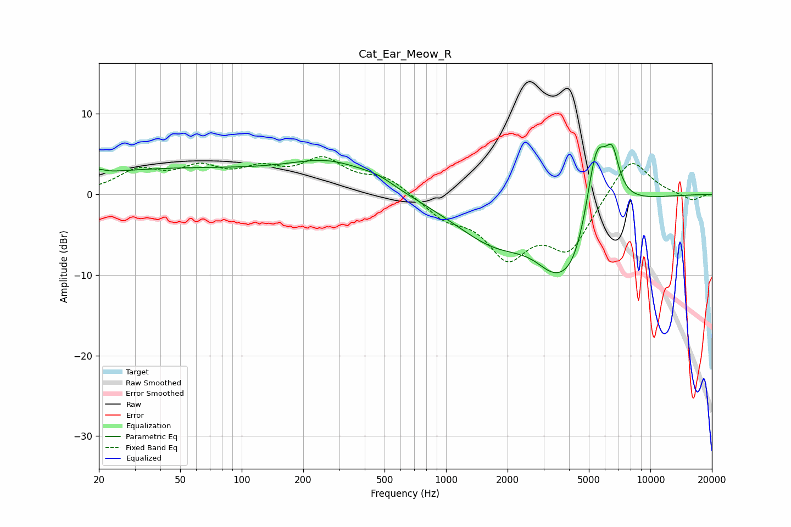

# Cat_Ear_Meow_R
See [usage instructions](https://github.com/jaakkopasanen/AutoEq#usage) for more options and info.

### Parametric EQs
Apply preamp of -6.3 dB when using parametric equalizer.

|   # | Type    |   Fc (Hz) |    Q |   Gain (dB) |
|-----|---------|-----------|------|-------------|
|   1 | Peaking |        20 | 5.15 |         0.5 |
|   2 | Peaking |        45 | 0.25 |         3   |
|   3 | Peaking |       278 | 0.67 |         3.4 |
|   4 | Peaking |       466 | 1.8  |         0.7 |
|   5 | Peaking |      1755 | 0.67 |        -5.6 |
|   6 | Peaking |      3277 | 1.77 |        -2.2 |
|   7 | Peaking |      4206 | 1.21 |        -8.6 |
|   8 | Peaking |      5396 | 3.2  |         5.7 |
|   9 | Peaking |      5612 | 1.88 |         5.9 |
|  10 | Peaking |      6522 | 4.3  |         4.5 |

### Fixed Band EQs
When using fixed band (also called graphic) equalizer, apply preamp of **-4.8 dB** (if available) and set gains manually with these parameters.

|   # | Type    |   Fc (Hz) |    Q |   Gain (dB) |
|-----|---------|-----------|------|-------------|
|   1 | Peaking |        31 | 1.41 |         2.7 |
|   2 | Peaking |        62 | 1.41 |         2.8 |
|   3 | Peaking |       125 | 1.41 |         2.5 |
|   4 | Peaking |       250 | 1.41 |         3.9 |
|   5 | Peaking |       500 | 1.41 |         2   |
|   6 | Peaking |      1000 | 1.41 |        -2.5 |
|   7 | Peaking |      2000 | 1.41 |        -7   |
|   8 | Peaking |      4000 | 1.41 |        -6.4 |
|   9 | Peaking |      8000 | 1.41 |         5   |
|  10 | Peaking |     16000 | 1.41 |        -0.8 |

### Graphs

