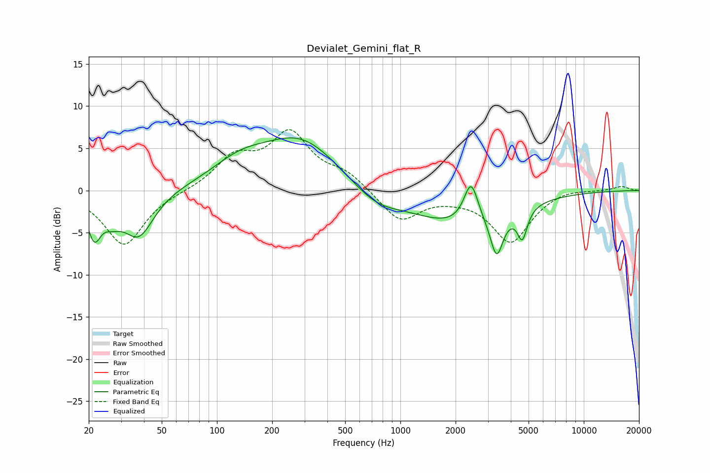

# Devialet_Gemini_flat_R
See [usage instructions](https://github.com/jaakkopasanen/AutoEq#usage) for more options and info.

### Parametric EQs
Apply preamp of -6.3 dB when using parametric equalizer.

|   # | Type    |   Fc (Hz) |    Q |   Gain (dB) |
|-----|---------|-----------|------|-------------|
|   1 | Peaking |        21 | 3.86 |        -4.5 |
|   2 | Peaking |        27 | 2.72 |        -1.7 |
|   3 | Peaking |        37 | 1.7  |        -5.3 |
|   4 | Peaking |       133 | 0.92 |         2.4 |
|   5 | Peaking |       287 | 0.65 |         6   |
|   6 | Peaking |       730 | 1.05 |        -2.1 |
|   7 | Peaking |      2052 | 0.56 |        -3.9 |
|   8 | Peaking |      2428 | 3.64 |         4.9 |
|   9 | Peaking |      3351 | 4.01 |        -5.1 |
|  10 | Peaking |      4621 | 5.2  |        -3.6 |

### Fixed Band EQs
When using fixed band (also called graphic) equalizer, apply preamp of **-7.3 dB** (if available) and set gains manually with these parameters.

|   # | Type    |   Fc (Hz) |    Q |   Gain (dB) |
|-----|---------|-----------|------|-------------|
|   1 | Peaking |        31 | 1.41 |        -6.5 |
|   2 | Peaking |        62 | 1.41 |        -0.1 |
|   3 | Peaking |       125 | 1.41 |         3.6 |
|   4 | Peaking |       250 | 1.41 |         6.4 |
|   5 | Peaking |       500 | 1.41 |         1.8 |
|   6 | Peaking |      1000 | 1.41 |        -3.7 |
|   7 | Peaking |      2000 | 1.41 |        -0.4 |
|   8 | Peaking |      4000 | 1.41 |        -6   |
|   9 | Peaking |      8000 | 1.41 |         0.4 |
|  10 | Peaking |     16000 | 1.41 |         0.5 |

### Graphs

