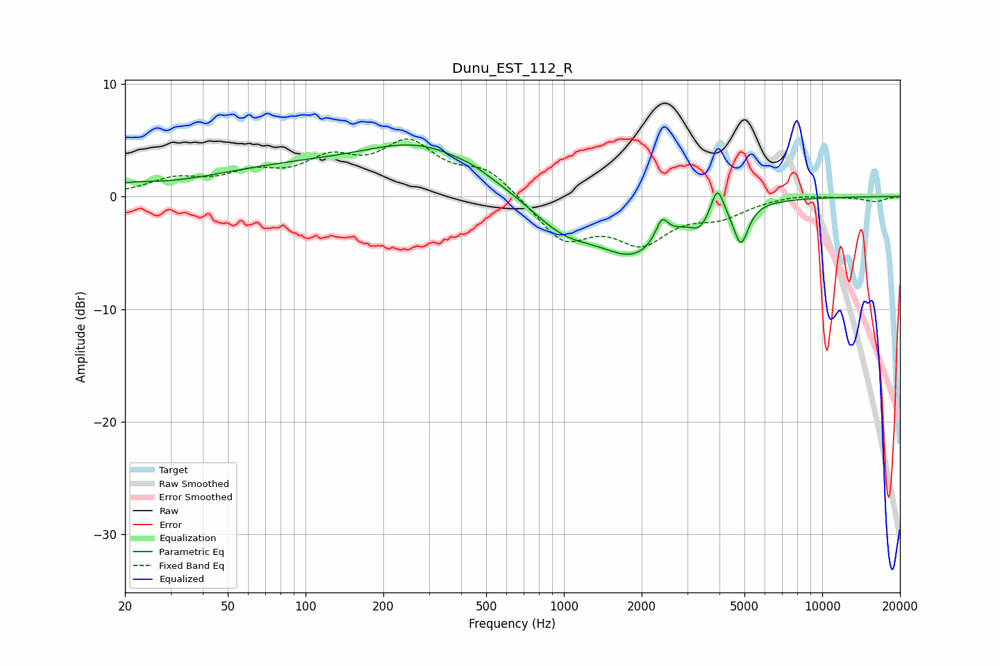

# Dunu_EST_112_R
See [usage instructions](https://github.com/jaakkopasanen/AutoEq#usage) for more options and info.

### Parametric EQs
Apply preamp of -4.7 dB when using parametric equalizer.

|   # | Type    |   Fc (Hz) |    Q |   Gain (dB) |
|-----|---------|-----------|------|-------------|
|   1 | Peaking |        21 | 1.51 |         0.6 |
|   2 | Peaking |        78 | 0.45 |         2.1 |
|   3 | Peaking |       286 | 0.58 |         4.2 |
|   4 | Peaking |       445 | 3.1  |         0.2 |
|   5 | Peaking |      1001 | 1.03 |        -3   |
|   6 | Peaking |      1880 | 1.07 |        -4.5 |
|   7 | Peaking |      2395 | 5.99 |         1.9 |
|   8 | Peaking |      3355 | 4.11 |        -1.3 |
|   9 | Peaking |      3929 | 6    |         2.6 |
|  10 | Peaking |      4843 | 4.86 |        -3.6 |

### Fixed Band EQs
When using fixed band (also called graphic) equalizer, apply preamp of **-5.2 dB** (if available) and set gains manually with these parameters.

|   # | Type    |   Fc (Hz) |    Q |   Gain (dB) |
|-----|---------|-----------|------|-------------|
|   1 | Peaking |        31 | 1.41 |         1.4 |
|   2 | Peaking |        62 | 1.41 |         1.7 |
|   3 | Peaking |       125 | 1.41 |         2.7 |
|   4 | Peaking |       250 | 1.41 |         4.3 |
|   5 | Peaking |       500 | 1.41 |         2.3 |
|   6 | Peaking |      1000 | 1.41 |        -3.8 |
|   7 | Peaking |      2000 | 1.41 |        -3.6 |
|   8 | Peaking |      4000 | 1.41 |        -1.5 |
|   9 | Peaking |      8000 | 1.41 |         0.3 |
|  10 | Peaking |     16000 | 1.41 |        -0.4 |

### Graphs

