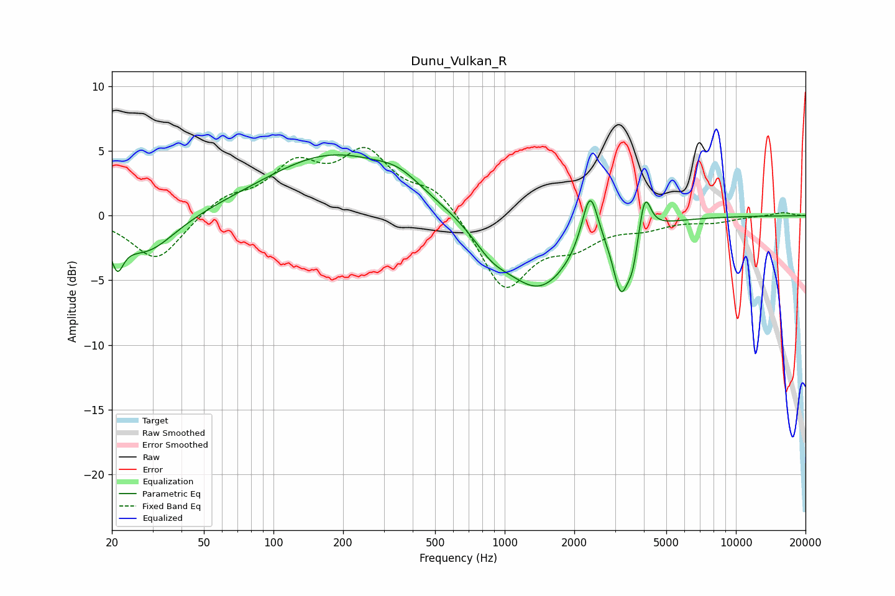

# Dunu_Vulkan_R
See [usage instructions](https://github.com/jaakkopasanen/AutoEq#usage) for more options and info.

### Parametric EQs
Apply preamp of -4.8 dB when using parametric equalizer.

|   # | Type    |   Fc (Hz) |    Q |   Gain (dB) |
|-----|---------|-----------|------|-------------|
|   1 | Peaking |        21 | 5.33 |        -2.5 |
|   2 | Peaking |        28 | 1.13 |        -3   |
|   3 | Peaking |       181 | 0.48 |         4.7 |
|   4 | Peaking |       348 | 1.5  |         1   |
|   5 | Peaking |       878 | 1.77 |        -1.5 |
|   6 | Peaking |      1413 | 0.92 |        -5.6 |
|   7 | Peaking |      2338 | 4.08 |         4.5 |
|   8 | Peaking |      3183 | 4.2  |        -4.7 |
|   9 | Peaking |      3581 | 6    |        -2.2 |
|  10 | Peaking |      4035 | 5.66 |         3.2 |

### Fixed Band EQs
When using fixed band (also called graphic) equalizer, apply preamp of **-5.4 dB** (if available) and set gains manually with these parameters.

|   # | Type    |   Fc (Hz) |    Q |   Gain (dB) |
|-----|---------|-----------|------|-------------|
|   1 | Peaking |        31 | 1.41 |        -3.6 |
|   2 | Peaking |        62 | 1.41 |         1.4 |
|   3 | Peaking |       125 | 1.41 |         3.5 |
|   4 | Peaking |       250 | 1.41 |         4.5 |
|   5 | Peaking |       500 | 1.41 |         2.1 |
|   6 | Peaking |      1000 | 1.41 |        -5.7 |
|   7 | Peaking |      2000 | 1.41 |        -1.9 |
|   8 | Peaking |      4000 | 1.41 |        -0.8 |
|   9 | Peaking |      8000 | 1.41 |        -0.4 |
|  10 | Peaking |     16000 | 1.41 |         0.3 |

### Graphs

