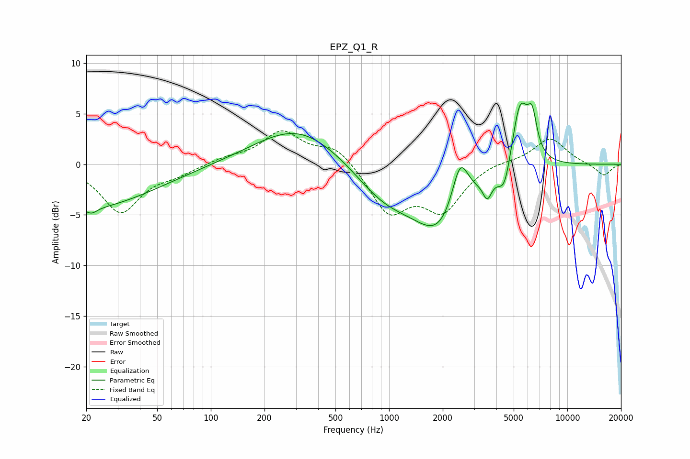

# EPZ_Q1_R
See [usage instructions](https://github.com/jaakkopasanen/AutoEq#usage) for more options and info.

### Parametric EQs
Apply preamp of -6.1 dB when using parametric equalizer.

|   # | Type    |   Fc (Hz) |    Q |   Gain (dB) |
|-----|---------|-----------|------|-------------|
|   1 | Peaking |        20 | 0.38 |        -4.3 |
|   2 | Peaking |        21 | 4.47 |        -0.6 |
|   3 | Peaking |       311 | 0.58 |         3.8 |
|   4 | Peaking |       940 | 0.82 |        -3.1 |
|   5 | Peaking |      1954 | 0.94 |        -6.2 |
|   6 | Peaking |      2500 | 2.92 |         5   |
|   7 | Peaking |      3556 | 5.74 |        -1.8 |
|   8 | Peaking |      4448 | 3.78 |        -3   |
|   9 | Peaking |      5423 | 2.83 |         6.8 |
|  10 | Peaking |      6354 | 5.23 |         3.4 |

### Fixed Band EQs
When using fixed band (also called graphic) equalizer, apply preamp of **-3.4 dB** (if available) and set gains manually with these parameters.

|   # | Type    |   Fc (Hz) |    Q |   Gain (dB) |
|-----|---------|-----------|------|-------------|
|   1 | Peaking |        31 | 1.41 |        -4.7 |
|   2 | Peaking |        62 | 1.41 |        -0.8 |
|   3 | Peaking |       125 | 1.41 |         0.6 |
|   4 | Peaking |       250 | 1.41 |         3.1 |
|   5 | Peaking |       500 | 1.41 |         1.8 |
|   6 | Peaking |      1000 | 1.41 |        -4.6 |
|   7 | Peaking |      2000 | 1.41 |        -4.3 |
|   8 | Peaking |      4000 | 1.41 |         0.4 |
|   9 | Peaking |      8000 | 1.41 |         2.6 |
|  10 | Peaking |     16000 | 1.41 |        -1.2 |

### Graphs

