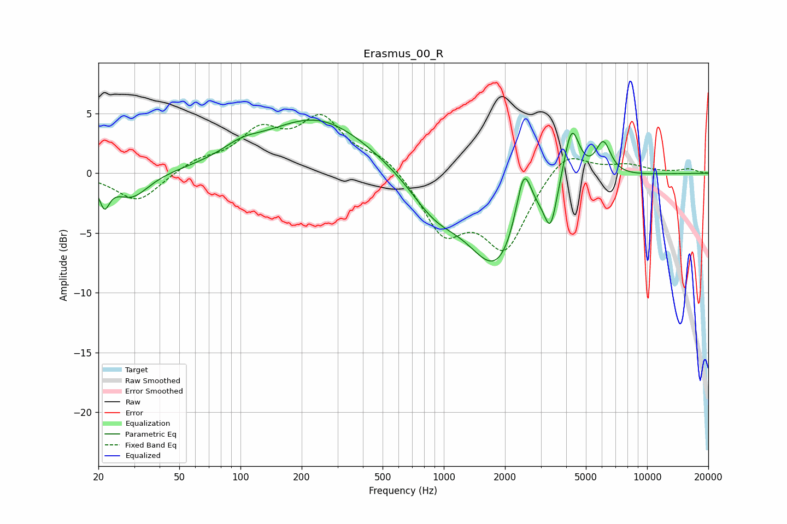

# Erasmus_00_R
See [usage instructions](https://github.com/jaakkopasanen/AutoEq#usage) for more options and info.

### Parametric EQs
Apply preamp of -4.5 dB when using parametric equalizer.

|   # | Type    |   Fc (Hz) |    Q |   Gain (dB) |
|-----|---------|-----------|------|-------------|
|   1 | Peaking |        21 | 5.68 |        -2.2 |
|   2 | Peaking |        29 | 1.68 |        -2.1 |
|   3 | Peaking |       101 | 1.49 |         0.9 |
|   4 | Peaking |       239 | 0.54 |         4.6 |
|   5 | Peaking |       899 | 1.14 |        -2.6 |
|   6 | Peaking |      1835 | 0.96 |        -7.8 |
|   7 | Peaking |      2472 | 3.55 |         5.3 |
|   8 | Peaking |      3352 | 4.78 |        -3.3 |
|   9 | Peaking |      4250 | 3.51 |         5   |
|  10 | Peaking |      6087 | 3.59 |         2.9 |

### Fixed Band EQs
When using fixed band (also called graphic) equalizer, apply preamp of **-5.0 dB** (if available) and set gains manually with these parameters.

|   # | Type    |   Fc (Hz) |    Q |   Gain (dB) |
|-----|---------|-----------|------|-------------|
|   1 | Peaking |        31 | 1.41 |        -2.4 |
|   2 | Peaking |        62 | 1.41 |         1   |
|   3 | Peaking |       125 | 1.41 |         3.2 |
|   4 | Peaking |       250 | 1.41 |         4.3 |
|   5 | Peaking |       500 | 1.41 |         1.4 |
|   6 | Peaking |      1000 | 1.41 |        -4.7 |
|   7 | Peaking |      2000 | 1.41 |        -6   |
|   8 | Peaking |      4000 | 1.41 |         2.2 |
|   9 | Peaking |      8000 | 1.41 |         0.7 |
|  10 | Peaking |     16000 | 1.41 |         0.3 |

### Graphs

