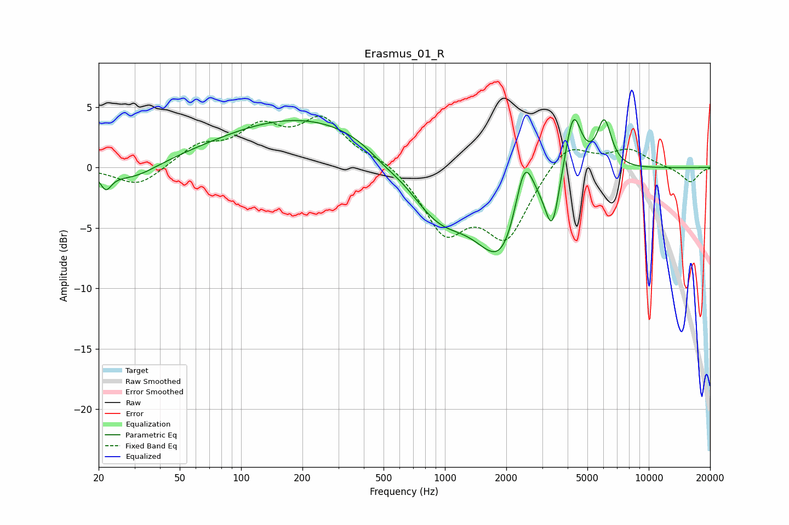

# Erasmus_01_R
See [usage instructions](https://github.com/jaakkopasanen/AutoEq#usage) for more options and info.

### Parametric EQs
Apply preamp of -4.0 dB when using parametric equalizer.

|   # | Type    |   Fc (Hz) |    Q |   Gain (dB) |
|-----|---------|-----------|------|-------------|
|   1 | Peaking |        22 | 5.24 |        -1.4 |
|   2 | Peaking |        29 | 1.15 |        -1.3 |
|   3 | Peaking |       214 | 0.33 |         4.3 |
|   4 | Peaking |       499 | 1.77 |        -0.6 |
|   5 | Peaking |       918 | 0.92 |        -4.3 |
|   6 | Peaking |      1940 | 1.11 |        -7.6 |
|   7 | Peaking |      2450 | 2.82 |         5.9 |
|   8 | Peaking |      3362 | 4.21 |        -4.3 |
|   9 | Peaking |      4258 | 3.42 |         5.5 |
|  10 | Peaking |      6051 | 3.82 |         4   |

### Fixed Band EQs
When using fixed band (also called graphic) equalizer, apply preamp of **-4.3 dB** (if available) and set gains manually with these parameters.

|   # | Type    |   Fc (Hz) |    Q |   Gain (dB) |
|-----|---------|-----------|------|-------------|
|   1 | Peaking |        31 | 1.41 |        -1.6 |
|   2 | Peaking |        62 | 1.41 |         1.7 |
|   3 | Peaking |       125 | 1.41 |         2.9 |
|   4 | Peaking |       250 | 1.41 |         3.7 |
|   5 | Peaking |       500 | 1.41 |         0.7 |
|   6 | Peaking |      1000 | 1.41 |        -5.1 |
|   7 | Peaking |      2000 | 1.41 |        -5.5 |
|   8 | Peaking |      4000 | 1.41 |         2.3 |
|   9 | Peaking |      8000 | 1.41 |         1.4 |
|  10 | Peaking |     16000 | 1.41 |        -1.3 |

### Graphs

