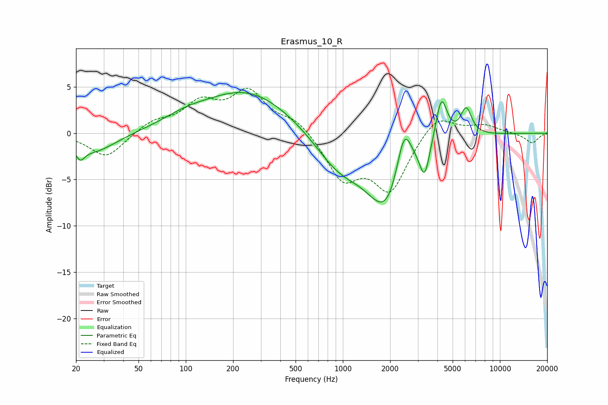

# Erasmus_10_R
See [usage instructions](https://github.com/jaakkopasanen/AutoEq#usage) for more options and info.

### Parametric EQs
Apply preamp of -4.5 dB when using parametric equalizer.

|   # | Type    |   Fc (Hz) |    Q |   Gain (dB) |
|-----|---------|-----------|------|-------------|
|   1 | Peaking |        21 | 5.14 |        -1.3 |
|   2 | Peaking |        26 | 0.98 |        -2.1 |
|   3 | Peaking |        99 | 0.99 |         0.8 |
|   4 | Peaking |       247 | 0.49 |         4.6 |
|   5 | Peaking |       939 | 0.9  |        -3.4 |
|   6 | Peaking |      1919 | 1.11 |        -8   |
|   7 | Peaking |      2452 | 2.81 |         5.8 |
|   8 | Peaking |      3318 | 4.54 |        -3.5 |
|   9 | Peaking |      4240 | 3.77 |         5   |
|  10 | Peaking |      6098 | 3.86 |         3   |

### Fixed Band EQs
When using fixed band (also called graphic) equalizer, apply preamp of **-4.9 dB** (if available) and set gains manually with these parameters.

|   # | Type    |   Fc (Hz) |    Q |   Gain (dB) |
|-----|---------|-----------|------|-------------|
|   1 | Peaking |        31 | 1.41 |        -2.7 |
|   2 | Peaking |        62 | 1.41 |         1.2 |
|   3 | Peaking |       125 | 1.41 |         3   |
|   4 | Peaking |       250 | 1.41 |         4.2 |
|   5 | Peaking |       500 | 1.41 |         1.5 |
|   6 | Peaking |      1000 | 1.41 |        -4.7 |
|   7 | Peaking |      2000 | 1.41 |        -6   |
|   8 | Peaking |      4000 | 1.41 |         2.3 |
|   9 | Peaking |      8000 | 1.41 |         0.8 |
|  10 | Peaking |     16000 | 1.41 |        -1.1 |

### Graphs

