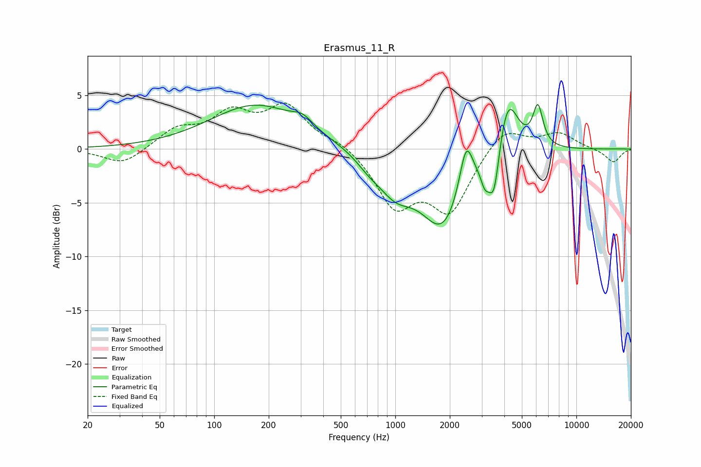

# Erasmus_11_R
See [usage instructions](https://github.com/jaakkopasanen/AutoEq#usage) for more options and info.

### Parametric EQs
Apply preamp of -4.3 dB when using parametric equalizer.

|   # | Type    |   Fc (Hz) |    Q |   Gain (dB) |
|-----|---------|-----------|------|-------------|
|   1 | Peaking |       170 | 0.56 |         4.1 |
|   2 | Peaking |       308 | 2.57 |         0.9 |
|   3 | Peaking |       714 | 2    |        -0.9 |
|   4 | Peaking |       999 | 1.44 |        -2.9 |
|   5 | Peaking |      1836 | 1.15 |        -7.1 |
|   6 | Peaking |      2461 | 3.82 |         4.6 |
|   7 | Peaking |      3126 | 5.98 |        -1.7 |
|   8 | Peaking |      3508 | 4.59 |        -4.8 |
|   9 | Peaking |      4171 | 2.43 |         5.8 |
|  10 | Peaking |      6130 | 4.98 |         3.7 |

### Fixed Band EQs
When using fixed band (also called graphic) equalizer, apply preamp of **-4.4 dB** (if available) and set gains manually with these parameters.

|   # | Type    |   Fc (Hz) |    Q |   Gain (dB) |
|-----|---------|-----------|------|-------------|
|   1 | Peaking |        31 | 1.41 |        -1.5 |
|   2 | Peaking |        62 | 1.41 |         1.7 |
|   3 | Peaking |       125 | 1.41 |         3   |
|   4 | Peaking |       250 | 1.41 |         3.8 |
|   5 | Peaking |       500 | 1.41 |         0.7 |
|   6 | Peaking |      1000 | 1.41 |        -5.1 |
|   7 | Peaking |      2000 | 1.41 |        -5.5 |
|   8 | Peaking |      4000 | 1.41 |         2.2 |
|   9 | Peaking |      8000 | 1.41 |         1.4 |
|  10 | Peaking |     16000 | 1.41 |        -1.3 |

### Graphs

