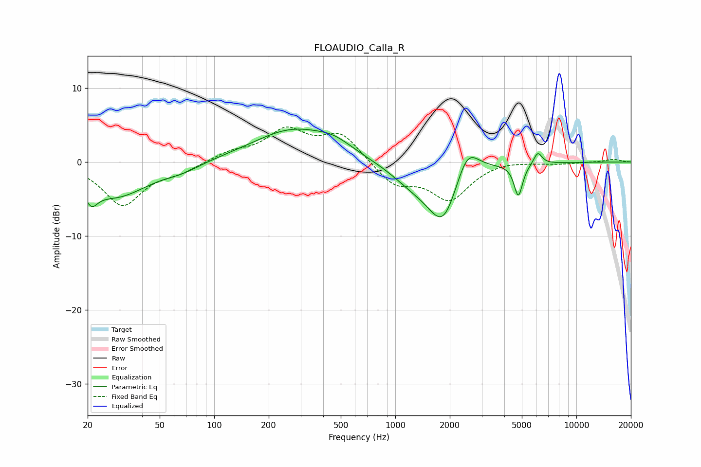

# FLOAUDIO_Calla_R
See [usage instructions](https://github.com/jaakkopasanen/AutoEq#usage) for more options and info.

### Parametric EQs
Apply preamp of -4.5 dB when using parametric equalizer.

|   # | Type    |   Fc (Hz) |    Q |   Gain (dB) |
|-----|---------|-----------|------|-------------|
|   1 | Peaking |        21 | 4.2  |        -2.3 |
|   2 | Peaking |        28 | 0.77 |        -4.6 |
|   3 | Peaking |        67 | 1.49 |        -0.7 |
|   4 | Peaking |       273 | 0.63 |         4.4 |
|   5 | Peaking |       463 | 1.46 |         1.2 |
|   6 | Peaking |      1255 | 1.08 |        -2.3 |
|   7 | Peaking |      1842 | 1.62 |        -7.7 |
|   8 | Peaking |      2491 | 2.21 |         4.5 |
|   9 | Peaking |      4781 | 6    |        -4.4 |
|  10 | Peaking |      6123 | 6    |         1.7 |

### Fixed Band EQs
When using fixed band (also called graphic) equalizer, apply preamp of **-4.8 dB** (if available) and set gains manually with these parameters.

|   # | Type    |   Fc (Hz) |    Q |   Gain (dB) |
|-----|---------|-----------|------|-------------|
|   1 | Peaking |        31 | 1.41 |        -5.8 |
|   2 | Peaking |        62 | 1.41 |        -1.1 |
|   3 | Peaking |       125 | 1.41 |         1.2 |
|   4 | Peaking |       250 | 1.41 |         4.1 |
|   5 | Peaking |       500 | 1.41 |         3.7 |
|   6 | Peaking |      1000 | 1.41 |        -3   |
|   7 | Peaking |      2000 | 1.41 |        -4.9 |
|   8 | Peaking |      4000 | 1.41 |         0.4 |
|   9 | Peaking |      8000 | 1.41 |        -0.2 |
|  10 | Peaking |     16000 | 1.41 |         0.4 |

### Graphs

