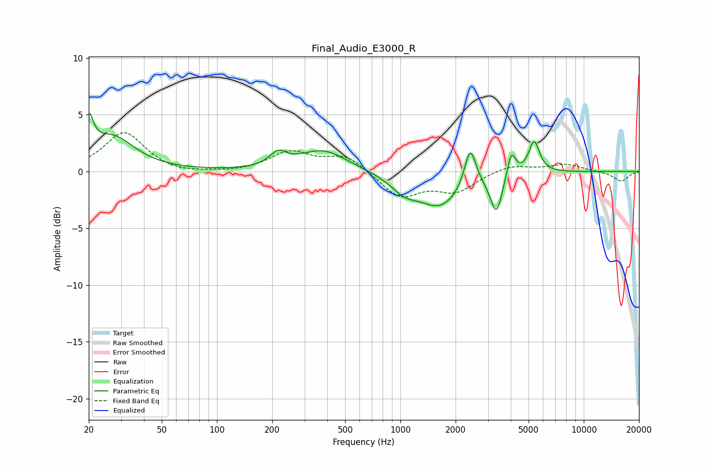

# Final_Audio_E3000_R
See [usage instructions](https://github.com/jaakkopasanen/AutoEq#usage) for more options and info.

### Parametric EQs
Apply preamp of -5.2 dB when using parametric equalizer.

|   # | Type    |   Fc (Hz) |    Q |   Gain (dB) |
|-----|---------|-----------|------|-------------|
|   1 | Peaking |        20 | 5.86 |         3.1 |
|   2 | Peaking |        27 | 1.17 |         3   |
|   3 | Peaking |       215 | 3.15 |         1.2 |
|   4 | Peaking |       378 | 1.08 |         1.9 |
|   5 | Peaking |      1049 | 1.87 |        -1.3 |
|   6 | Peaking |      1650 | 1.21 |        -3   |
|   7 | Peaking |      2403 | 4.6  |         3.5 |
|   8 | Peaking |      3337 | 4.33 |        -3.5 |
|   9 | Peaking |      4028 | 6    |         2.3 |
|  10 | Peaking |      5363 | 4.75 |         2.8 |

### Fixed Band EQs
When using fixed band (also called graphic) equalizer, apply preamp of **-3.5 dB** (if available) and set gains manually with these parameters.

|   # | Type    |   Fc (Hz) |    Q |   Gain (dB) |
|-----|---------|-----------|------|-------------|
|   1 | Peaking |        31 | 1.41 |         3.4 |
|   2 | Peaking |        62 | 1.41 |        -0.3 |
|   3 | Peaking |       125 | 1.41 |        -0.1 |
|   4 | Peaking |       250 | 1.41 |         1.7 |
|   5 | Peaking |       500 | 1.41 |         1.4 |
|   6 | Peaking |      1000 | 1.41 |        -2.2 |
|   7 | Peaking |      2000 | 1.41 |        -1.7 |
|   8 | Peaking |      4000 | 1.41 |         0.6 |
|   9 | Peaking |      8000 | 1.41 |         0.6 |
|  10 | Peaking |     16000 | 1.41 |        -0.9 |

### Graphs

