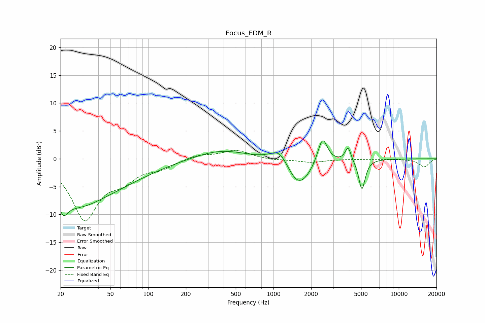

# Focus_EDM_R
See [usage instructions](https://github.com/jaakkopasanen/AutoEq#usage) for more options and info.

### Parametric EQs
Apply preamp of -3.3 dB when using parametric equalizer.

|   # | Type    |   Fc (Hz) |    Q |   Gain (dB) |
|-----|---------|-----------|------|-------------|
|   1 | Peaking |        21 | 4.49 |         4.1 |
|   2 | Peaking |        21 | 4.14 |        -7.4 |
|   3 | Peaking |        27 | 0.71 |        -5.7 |
|   4 | Peaking |        52 | 0.46 |        -3.4 |
|   5 | Peaking |       377 | 0.69 |         1.7 |
|   6 | Peaking |      1124 | 1.93 |         3.1 |
|   7 | Peaking |      1584 | 1.39 |        -5.5 |
|   8 | Peaking |      2462 | 3.57 |         5   |
|   9 | Peaking |      3940 | 6    |         2.6 |
|  10 | Peaking |      5080 | 5.42 |        -5.5 |

### Fixed Band EQs
When using fixed band (also called graphic) equalizer, apply preamp of **-1.6 dB** (if available) and set gains manually with these parameters.

|   # | Type    |   Fc (Hz) |    Q |   Gain (dB) |
|-----|---------|-----------|------|-------------|
|   1 | Peaking |        31 | 1.41 |       -10.6 |
|   2 | Peaking |        62 | 1.41 |        -2.9 |
|   3 | Peaking |       125 | 1.41 |        -1.4 |
|   4 | Peaking |       250 | 1.41 |         0.8 |
|   5 | Peaking |       500 | 1.41 |         1.5 |
|   6 | Peaking |      1000 | 1.41 |        -0.3 |
|   7 | Peaking |      2000 | 1.41 |        -0.6 |
|   8 | Peaking |      4000 | 1.41 |        -0   |
|   9 | Peaking |      8000 | 1.41 |        -0   |
|  10 | Peaking |     16000 | 1.41 |        -1.4 |

### Graphs

