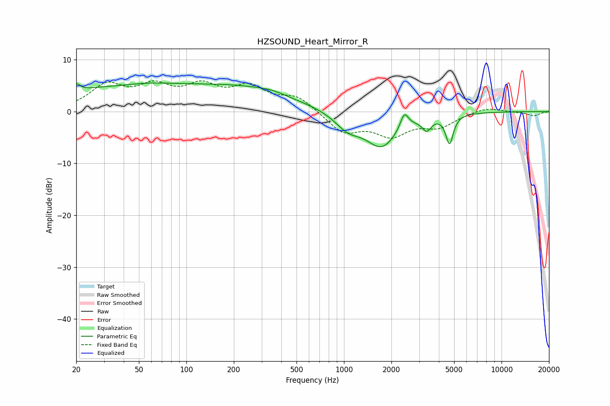

# HZSOUND_Heart_Mirror_R
See [usage instructions](https://github.com/jaakkopasanen/AutoEq#usage) for more options and info.

### Parametric EQs
Apply preamp of -5.6 dB when using parametric equalizer.

|   # | Type    |   Fc (Hz) |    Q |   Gain (dB) |
|-----|---------|-----------|------|-------------|
|   1 | Peaking |        20 | 5.82 |         1.5 |
|   2 | Peaking |        38 | 1.01 |        -0.8 |
|   3 | Peaking |        39 | 0.41 |         5.2 |
|   4 | Peaking |       219 | 0.43 |         4   |
|   5 | Peaking |       343 | 1.52 |         0.6 |
|   6 | Peaking |      1058 | 1.73 |        -2.8 |
|   7 | Peaking |      1733 | 1.36 |        -6.6 |
|   8 | Peaking |      2415 | 5.5  |         3.2 |
|   9 | Peaking |      3350 | 4.94 |        -2.3 |
|  10 | Peaking |      4676 | 6    |        -5.5 |

### Fixed Band EQs
When using fixed band (also called graphic) equalizer, apply preamp of **-6.0 dB** (if available) and set gains manually with these parameters.

|   # | Type    |   Fc (Hz) |    Q |   Gain (dB) |
|-----|---------|-----------|------|-------------|
|   1 | Peaking |        31 | 1.41 |         4.7 |
|   2 | Peaking |        62 | 1.41 |         4.1 |
|   3 | Peaking |       125 | 1.41 |         4.2 |
|   4 | Peaking |       250 | 1.41 |         4.2 |
|   5 | Peaking |       500 | 1.41 |         2.8 |
|   6 | Peaking |      1000 | 1.41 |        -3.9 |
|   7 | Peaking |      2000 | 1.41 |        -4.1 |
|   8 | Peaking |      4000 | 1.41 |        -2.6 |
|   9 | Peaking |      8000 | 1.41 |         0.9 |
|  10 | Peaking |     16000 | 1.41 |        -0.8 |

### Graphs

