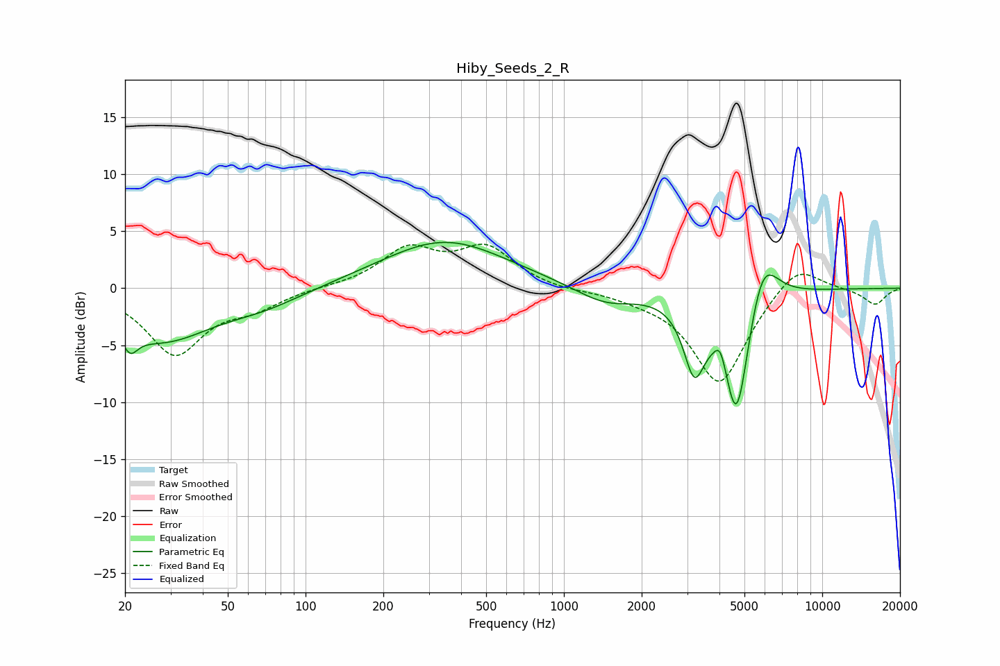

# Hiby_Seeds_2_R
See [usage instructions](https://github.com/jaakkopasanen/AutoEq#usage) for more options and info.

### Parametric EQs
Apply preamp of -4.1 dB when using parametric equalizer.

|   # | Type    |   Fc (Hz) |    Q |   Gain (dB) |
|-----|---------|-----------|------|-------------|
|   1 | Peaking |        21 | 5.84 |         3.2 |
|   2 | Peaking |        21 | 5.44 |        -5.1 |
|   3 | Peaking |        28 | 0.72 |        -4.4 |
|   4 | Peaking |        69 | 0.91 |        -1.1 |
|   5 | Peaking |       345 | 0.59 |         4.2 |
|   6 | Peaking |      1444 | 1.2  |        -1.5 |
|   7 | Peaking |      3195 | 3.4  |        -5.8 |
|   8 | Peaking |      4039 | 5.97 |         2   |
|   9 | Peaking |      4663 | 2.57 |       -12.2 |
|  10 | Peaking |      5848 | 2.29 |         5.4 |

### Fixed Band EQs
When using fixed band (also called graphic) equalizer, apply preamp of **-4.0 dB** (if available) and set gains manually with these parameters.

|   # | Type    |   Fc (Hz) |    Q |   Gain (dB) |
|-----|---------|-----------|------|-------------|
|   1 | Peaking |        31 | 1.41 |        -5.7 |
|   2 | Peaking |        62 | 1.41 |        -1.4 |
|   3 | Peaking |       125 | 1.41 |         0.1 |
|   4 | Peaking |       250 | 1.41 |         3.3 |
|   5 | Peaking |       500 | 1.41 |         3.4 |
|   6 | Peaking |      1000 | 1.41 |        -0.2 |
|   7 | Peaking |      2000 | 1.41 |        -0.5 |
|   8 | Peaking |      4000 | 1.41 |        -8.4 |
|   9 | Peaking |      8000 | 1.41 |         2.5 |
|  10 | Peaking |     16000 | 1.41 |        -1.4 |

### Graphs

