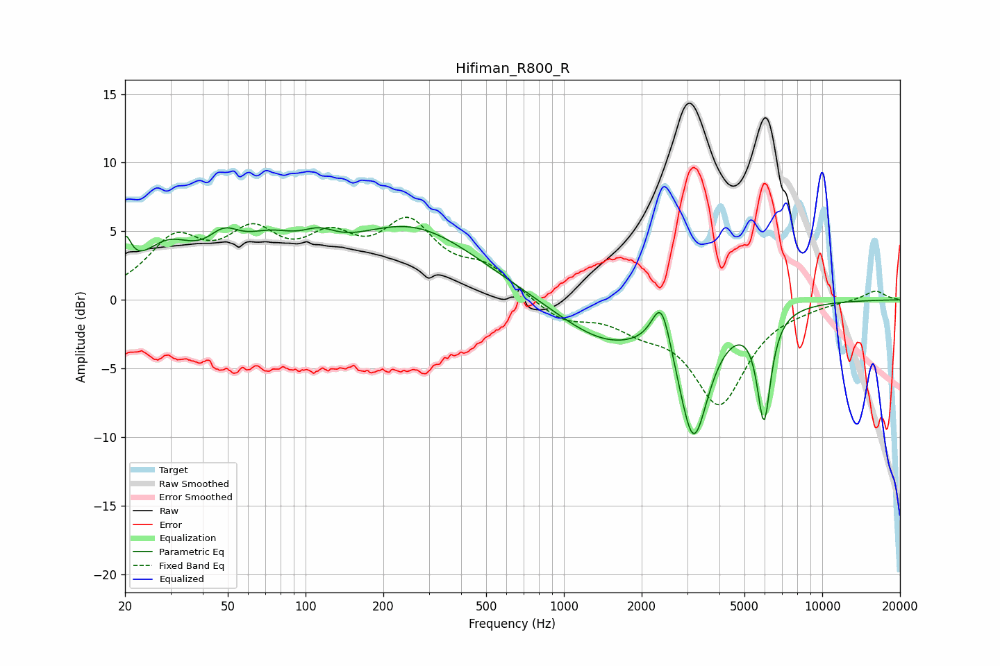

# Hifiman_R800_R
See [usage instructions](https://github.com/jaakkopasanen/AutoEq#usage) for more options and info.

### Parametric EQs
Apply preamp of -5.4 dB when using parametric equalizer.

|   # | Type    |   Fc (Hz) |    Q |   Gain (dB) |
|-----|---------|-----------|------|-------------|
|   1 | Peaking |        20 | 6    |         2.6 |
|   2 | Peaking |        29 | 1.32 |         3.3 |
|   3 | Peaking |        48 | 2.25 |         2   |
|   4 | Peaking |        72 | 1.16 |         2.7 |
|   5 | Peaking |       113 | 2.12 |         1.2 |
|   6 | Peaking |       256 | 0.54 |         5.2 |
|   7 | Peaking |      1454 | 0.74 |        -3.1 |
|   8 | Peaking |      2388 | 3.73 |         3.9 |
|   9 | Peaking |      3174 | 2.38 |        -9.3 |
|  10 | Peaking |      5950 | 5.24 |        -7.8 |

### Fixed Band EQs
When using fixed band (also called graphic) equalizer, apply preamp of **-6.1 dB** (if available) and set gains manually with these parameters.

|   # | Type    |   Fc (Hz) |    Q |   Gain (dB) |
|-----|---------|-----------|------|-------------|
|   1 | Peaking |        31 | 1.41 |         4   |
|   2 | Peaking |        62 | 1.41 |         4   |
|   3 | Peaking |       125 | 1.41 |         3.4 |
|   4 | Peaking |       250 | 1.41 |         4.9 |
|   5 | Peaking |       500 | 1.41 |         2   |
|   6 | Peaking |      1000 | 1.41 |        -1.5 |
|   7 | Peaking |      2000 | 1.41 |        -1.5 |
|   8 | Peaking |      4000 | 1.41 |        -7.3 |
|   9 | Peaking |      8000 | 1.41 |        -0.2 |
|  10 | Peaking |     16000 | 1.41 |         0.7 |

### Graphs

