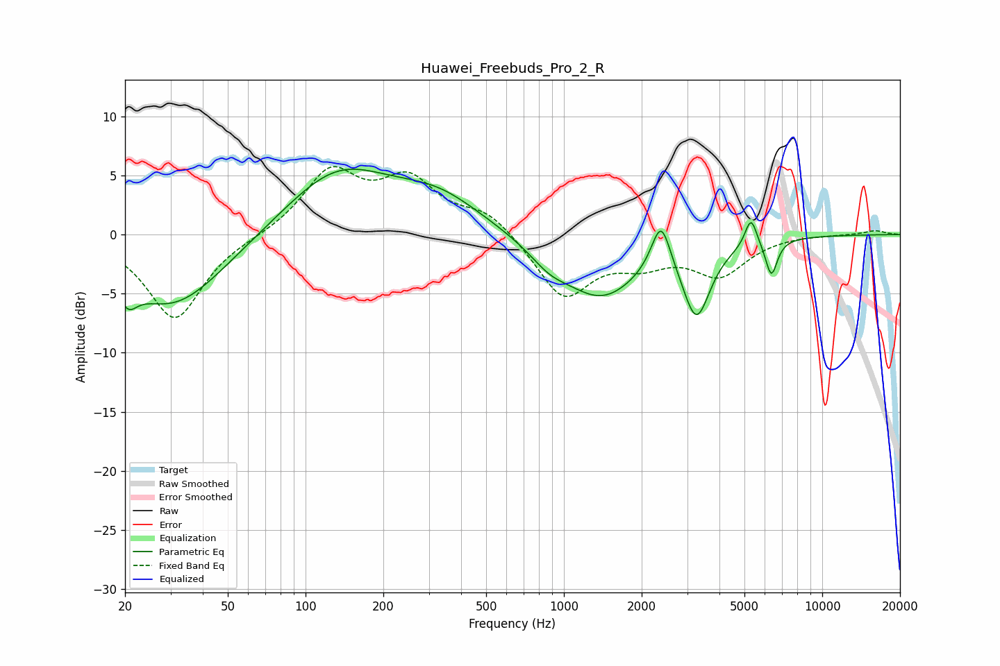

# Huawei_Freebuds_Pro_2_R
See [usage instructions](https://github.com/jaakkopasanen/AutoEq#usage) for more options and info.

### Parametric EQs
Apply preamp of -5.6 dB when using parametric equalizer.

|   # | Type    |   Fc (Hz) |    Q |   Gain (dB) |
|-----|---------|-----------|------|-------------|
|   1 | Peaking |        21 | 4.13 |        -1.9 |
|   2 | Peaking |        31 | 0.69 |        -6.3 |
|   3 | Peaking |       133 | 0.68 |         5.5 |
|   4 | Peaking |       328 | 0.82 |         2.6 |
|   5 | Peaking |       876 | 1.88 |        -1.2 |
|   6 | Peaking |      1395 | 0.91 |        -5.2 |
|   7 | Peaking |      2376 | 3.8  |         4.3 |
|   8 | Peaking |      3261 | 2.68 |        -6.1 |
|   9 | Peaking |      5299 | 6    |         2.5 |
|  10 | Peaking |      6356 | 6    |        -3.1 |

### Fixed Band EQs
When using fixed band (also called graphic) equalizer, apply preamp of **-5.8 dB** (if available) and set gains manually with these parameters.

|   # | Type    |   Fc (Hz) |    Q |   Gain (dB) |
|-----|---------|-----------|------|-------------|
|   1 | Peaking |        31 | 1.41 |        -7.2 |
|   2 | Peaking |        62 | 1.41 |        -0.1 |
|   3 | Peaking |       125 | 1.41 |         5.2 |
|   4 | Peaking |       250 | 1.41 |         4.2 |
|   5 | Peaking |       500 | 1.41 |         1.9 |
|   6 | Peaking |      1000 | 1.41 |        -5.3 |
|   7 | Peaking |      2000 | 1.41 |        -1.9 |
|   8 | Peaking |      4000 | 1.41 |        -3.2 |
|   9 | Peaking |      8000 | 1.41 |         0.1 |
|  10 | Peaking |     16000 | 1.41 |         0.4 |

### Graphs

