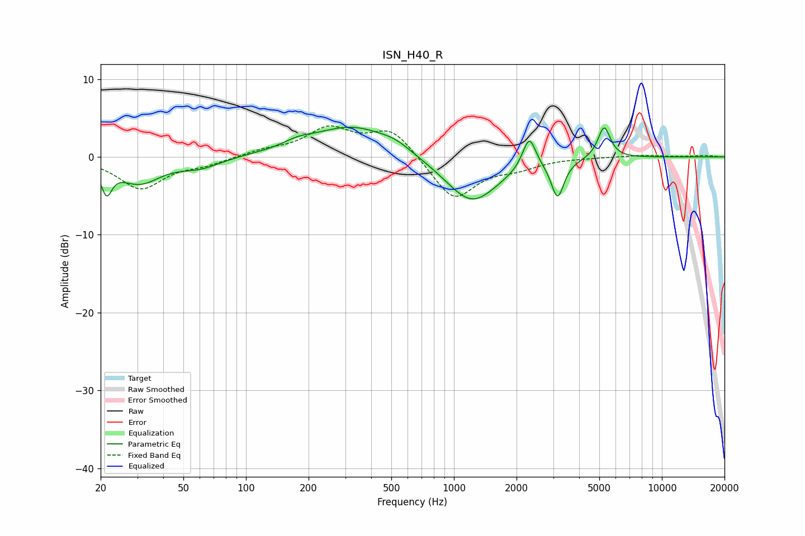

# ISN_H40_R
See [usage instructions](https://github.com/jaakkopasanen/AutoEq#usage) for more options and info.

### Parametric EQs
Apply preamp of -3.9 dB when using parametric equalizer.

|   # | Type    |   Fc (Hz) |    Q |   Gain (dB) |
|-----|---------|-----------|------|-------------|
|   1 | Peaking |        21 | 5.67 |        -3.4 |
|   2 | Peaking |        31 | 1.38 |        -3.2 |
|   3 | Peaking |        60 | 1.45 |        -1.2 |
|   4 | Peaking |       177 | 2.06 |         0.7 |
|   5 | Peaking |       324 | 0.73 |         4   |
|   6 | Peaking |       523 | 1.93 |         0.8 |
|   7 | Peaking |      1218 | 1.1  |        -6.1 |
|   8 | Peaking |      2301 | 4.47 |         4.2 |
|   9 | Peaking |      3151 | 4.66 |        -4.8 |
|  10 | Peaking |      5275 | 4.7  |         4.1 |

### Fixed Band EQs
When using fixed band (also called graphic) equalizer, apply preamp of **-4.1 dB** (if available) and set gains manually with these parameters.

|   # | Type    |   Fc (Hz) |    Q |   Gain (dB) |
|-----|---------|-----------|------|-------------|
|   1 | Peaking |        31 | 1.41 |        -4   |
|   2 | Peaking |        62 | 1.41 |        -0.8 |
|   3 | Peaking |       125 | 1.41 |         0.7 |
|   4 | Peaking |       250 | 1.41 |         3.4 |
|   5 | Peaking |       500 | 1.41 |         3.6 |
|   6 | Peaking |      1000 | 1.41 |        -5.6 |
|   7 | Peaking |      2000 | 1.41 |        -1.1 |
|   8 | Peaking |      4000 | 1.41 |        -0   |
|   9 | Peaking |      8000 | 1.41 |         0.2 |
|  10 | Peaking |     16000 | 1.41 |         0.2 |

### Graphs

