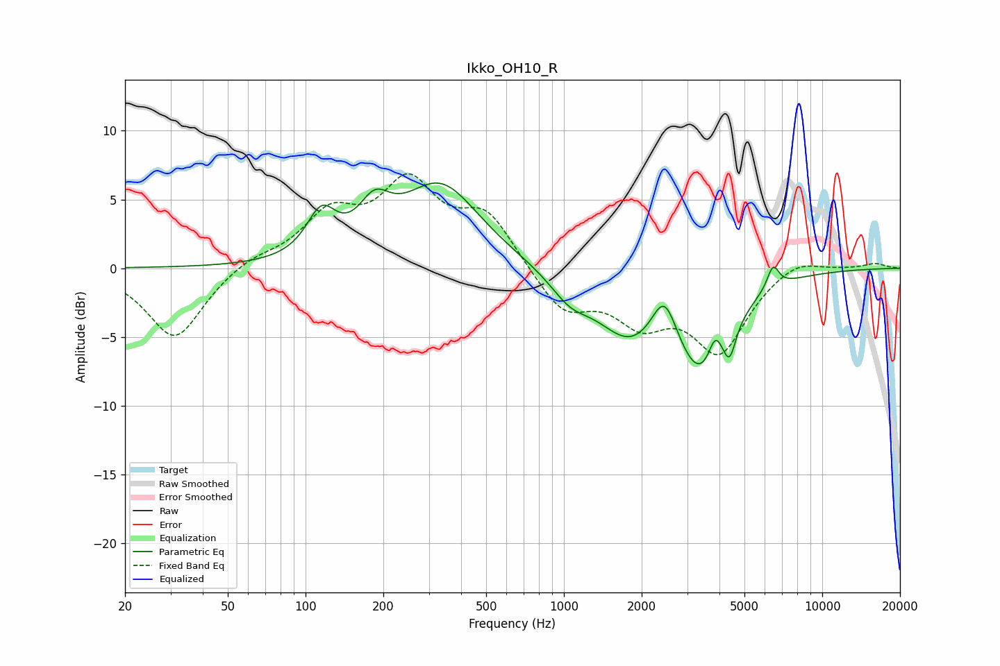

# Ikko_OH10_R
See [usage instructions](https://github.com/jaakkopasanen/AutoEq#usage) for more options and info.

### Parametric EQs
Apply preamp of -6.3 dB when using parametric equalizer.

|   # | Type    |   Fc (Hz) |    Q |   Gain (dB) |
|-----|---------|-----------|------|-------------|
|   1 | Peaking |       115 | 2.5  |         3.2 |
|   2 | Peaking |       185 | 2.34 |         2.7 |
|   3 | Peaking |       333 | 0.92 |         6   |
|   4 | Peaking |      1055 | 1.85 |        -1.6 |
|   5 | Peaking |      1778 | 1.1  |        -4.2 |
|   6 | Peaking |      2449 | 2.92 |         3.5 |
|   7 | Peaking |      3410 | 1.35 |        -6.9 |
|   8 | Peaking |      3846 | 5.41 |         1.9 |
|   9 | Peaking |      4379 | 5.95 |        -2.2 |
|  10 | Peaking |      6453 | 5.92 |         1.7 |

### Fixed Band EQs
When using fixed band (also called graphic) equalizer, apply preamp of **-7.0 dB** (if available) and set gains manually with these parameters.

|   # | Type    |   Fc (Hz) |    Q |   Gain (dB) |
|-----|---------|-----------|------|-------------|
|   1 | Peaking |        31 | 1.41 |        -5.2 |
|   2 | Peaking |        62 | 1.41 |         0.8 |
|   3 | Peaking |       125 | 1.41 |         3.6 |
|   4 | Peaking |       250 | 1.41 |         5.7 |
|   5 | Peaking |       500 | 1.41 |         3.7 |
|   6 | Peaking |      1000 | 1.41 |        -3.1 |
|   7 | Peaking |      2000 | 1.41 |        -3.3 |
|   8 | Peaking |      4000 | 1.41 |        -5.8 |
|   9 | Peaking |      8000 | 1.41 |         0.9 |
|  10 | Peaking |     16000 | 1.41 |         0.4 |

### Graphs

