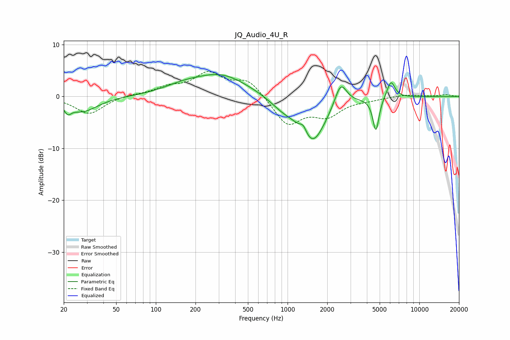

# JQ_Audio_4U_R
See [usage instructions](https://github.com/jaakkopasanen/AutoEq#usage) for more options and info.

### Parametric EQs
Apply preamp of -4.3 dB when using parametric equalizer.

|   # | Type    |   Fc (Hz) |    Q |   Gain (dB) |
|-----|---------|-----------|------|-------------|
|   1 | Peaking |        21 | 5.61 |        -1.5 |
|   2 | Peaking |        28 | 1.22 |        -2.9 |
|   3 | Peaking |       159 | 0.98 |         1.2 |
|   4 | Peaking |       314 | 0.68 |         4.1 |
|   5 | Peaking |       917 | 1.43 |        -1.7 |
|   6 | Peaking |      1316 | 5.63 |         1.5 |
|   7 | Peaking |      1549 | 1.4  |        -8.8 |
|   8 | Peaking |      2530 | 3.04 |         4.7 |
|   9 | Peaking |      4681 | 6    |        -6.5 |
|  10 | Peaking |      6085 | 4.44 |         3.4 |

### Fixed Band EQs
When using fixed band (also called graphic) equalizer, apply preamp of **-4.9 dB** (if available) and set gains manually with these parameters.

|   # | Type    |   Fc (Hz) |    Q |   Gain (dB) |
|-----|---------|-----------|------|-------------|
|   1 | Peaking |        31 | 1.41 |        -3.4 |
|   2 | Peaking |        62 | 1.41 |         0.3 |
|   3 | Peaking |       125 | 1.41 |         1.5 |
|   4 | Peaking |       250 | 1.41 |         4.2 |
|   5 | Peaking |       500 | 1.41 |         3.2 |
|   6 | Peaking |      1000 | 1.41 |        -5.5 |
|   7 | Peaking |      2000 | 1.41 |        -3.3 |
|   8 | Peaking |      4000 | 1.41 |        -0.5 |
|   9 | Peaking |      8000 | 1.41 |         0.4 |
|  10 | Peaking |     16000 | 1.41 |         0.4 |

### Graphs

