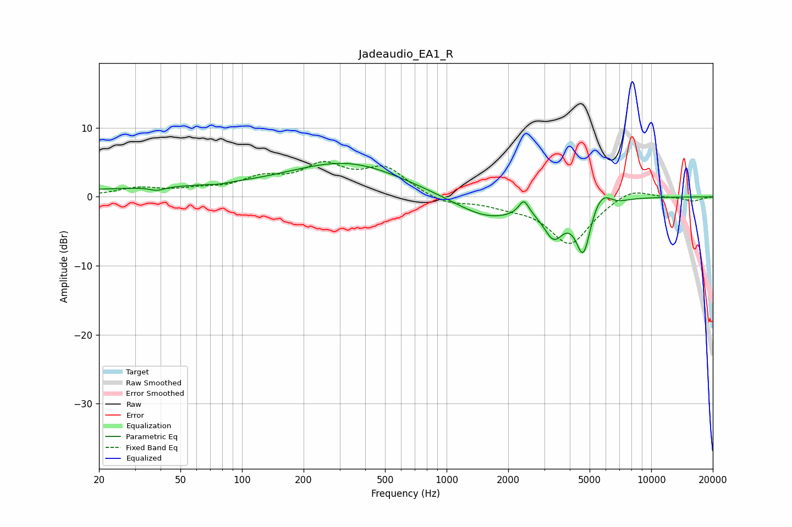

# Jadeaudio_EA1_R
See [usage instructions](https://github.com/jaakkopasanen/AutoEq#usage) for more options and info.

### Parametric EQs
Apply preamp of -4.9 dB when using parametric equalizer.

|   # | Type    |   Fc (Hz) |    Q |   Gain (dB) |
|-----|---------|-----------|------|-------------|
|   1 | Peaking |        38 | 4.26 |        -0.5 |
|   2 | Peaking |        54 | 0.19 |         1.3 |
|   3 | Peaking |        77 | 3.58 |        -0.2 |
|   4 | Peaking |       337 | 0.52 |         4.4 |
|   5 | Peaking |      1596 | 0.85 |        -3.3 |
|   6 | Peaking |      2387 | 5.65 |         2.2 |
|   7 | Peaking |      3340 | 2.84 |        -4.6 |
|   8 | Peaking |      4662 | 3.69 |        -8   |
|   9 | Peaking |      5708 | 2.25 |         3.1 |
|  10 | Peaking |      6580 | 2.3  |        -1.1 |

### Fixed Band EQs
When using fixed band (also called graphic) equalizer, apply preamp of **-5.2 dB** (if available) and set gains manually with these parameters.

|   # | Type    |   Fc (Hz) |    Q |   Gain (dB) |
|-----|---------|-----------|------|-------------|
|   1 | Peaking |        31 | 1.41 |         1.2 |
|   2 | Peaking |        62 | 1.41 |         0.8 |
|   3 | Peaking |       125 | 1.41 |         2.2 |
|   4 | Peaking |       250 | 1.41 |         4   |
|   5 | Peaking |       500 | 1.41 |         3.9 |
|   6 | Peaking |      1000 | 1.41 |        -1.2 |
|   7 | Peaking |      2000 | 1.41 |        -0.9 |
|   8 | Peaking |      4000 | 1.41 |        -6.8 |
|   9 | Peaking |      8000 | 1.41 |         1.5 |
|  10 | Peaking |     16000 | 1.41 |        -0.6 |

### Graphs

