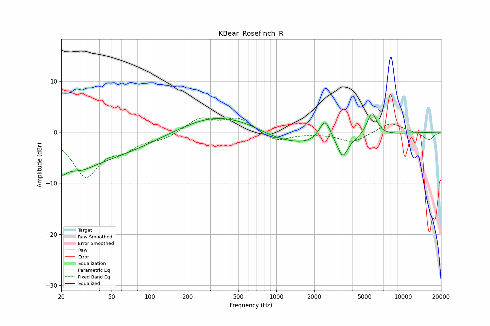

# KBear_Rosefinch_R
See [usage instructions](https://github.com/jaakkopasanen/AutoEq#usage) for more options and info.

### Parametric EQs
Apply preamp of -3.7 dB when using parametric equalizer.

|   # | Type    |   Fc (Hz) |    Q |   Gain (dB) |
|-----|---------|-----------|------|-------------|
|   1 | Peaking |        20 | 4.98 |        -5.6 |
|   2 | Peaking |        21 | 5.94 |         3.2 |
|   3 | Peaking |        28 | 1.27 |        -2.1 |
|   4 | Peaking |        33 | 0.32 |        -5.3 |
|   5 | Peaking |       346 | 0.52 |         3.8 |
|   6 | Peaking |       603 | 1.1  |         0.6 |
|   7 | Peaking |      1591 | 0.35 |        -2.9 |
|   8 | Peaking |      2428 | 3.02 |         4.6 |
|   9 | Peaking |      3343 | 3.59 |        -3.7 |
|  10 | Peaking |      5697 | 3.43 |         4.8 |

### Fixed Band EQs
When using fixed band (also called graphic) equalizer, apply preamp of **-2.9 dB** (if available) and set gains manually with these parameters.

|   # | Type    |   Fc (Hz) |    Q |   Gain (dB) |
|-----|---------|-----------|------|-------------|
|   1 | Peaking |        31 | 1.41 |        -8.4 |
|   2 | Peaking |        62 | 1.41 |        -2.5 |
|   3 | Peaking |       125 | 1.41 |        -1.2 |
|   4 | Peaking |       250 | 1.41 |         2.7 |
|   5 | Peaking |       500 | 1.41 |         2.7 |
|   6 | Peaking |      1000 | 1.41 |        -1.9 |
|   7 | Peaking |      2000 | 1.41 |        -0.2 |
|   8 | Peaking |      4000 | 1.41 |        -2   |
|   9 | Peaking |      8000 | 1.41 |         2   |
|  10 | Peaking |     16000 | 1.41 |        -1.6 |

### Graphs

