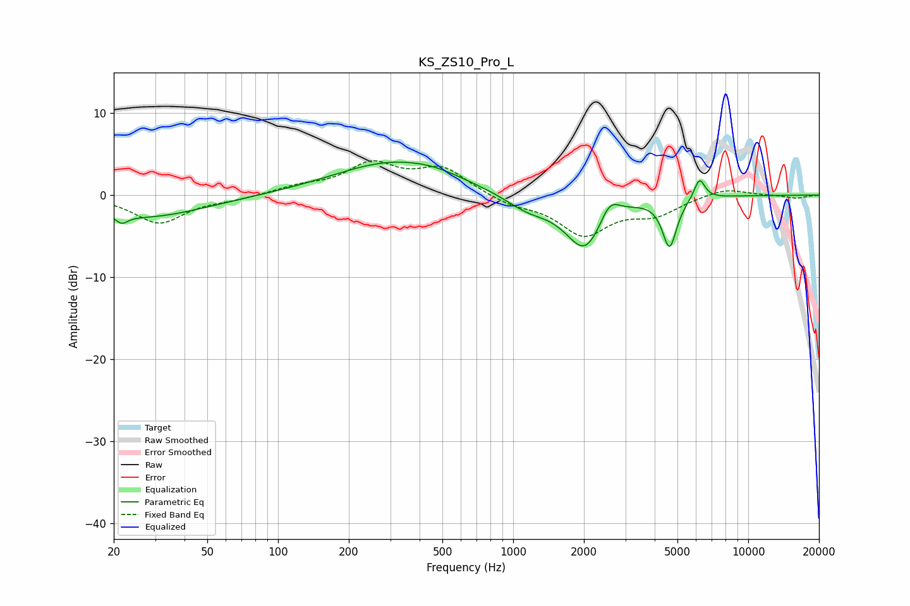

# KS_ZS10_Pro_L
See [usage instructions](https://github.com/jaakkopasanen/AutoEq#usage) for more options and info.

### Parametric EQs
Apply preamp of -4.1 dB when using parametric equalizer.

|   # | Type    |   Fc (Hz) |    Q |   Gain (dB) |
|-----|---------|-----------|------|-------------|
|   1 | Peaking |        22 | 5.99 |         2.1 |
|   2 | Peaking |        22 | 5.88 |        -3.1 |
|   3 | Peaking |        27 | 0.56 |        -2.7 |
|   4 | Peaking |       308 | 0.56 |         4   |
|   5 | Peaking |       467 | 1.36 |         0.5 |
|   6 | Peaking |      1153 | 1.43 |        -1.7 |
|   7 | Peaking |      2021 | 1.7  |        -6.6 |
|   8 | Peaking |      2572 | 3.4  |         2.6 |
|   9 | Peaking |      4627 | 4.61 |        -6   |
|  10 | Peaking |      6203 | 5.9  |         2.6 |

### Fixed Band EQs
When using fixed band (also called graphic) equalizer, apply preamp of **-4.3 dB** (if available) and set gains manually with these parameters.

|   # | Type    |   Fc (Hz) |    Q |   Gain (dB) |
|-----|---------|-----------|------|-------------|
|   1 | Peaking |        31 | 1.41 |        -3.4 |
|   2 | Peaking |        62 | 1.41 |        -0.4 |
|   3 | Peaking |       125 | 1.41 |         0.9 |
|   4 | Peaking |       250 | 1.41 |         3.6 |
|   5 | Peaking |       500 | 1.41 |         3.1 |
|   6 | Peaking |      1000 | 1.41 |        -1.1 |
|   7 | Peaking |      2000 | 1.41 |        -4.6 |
|   8 | Peaking |      4000 | 1.41 |        -2.1 |
|   9 | Peaking |      8000 | 1.41 |         0.9 |
|  10 | Peaking |     16000 | 1.41 |        -0.4 |

### Graphs

