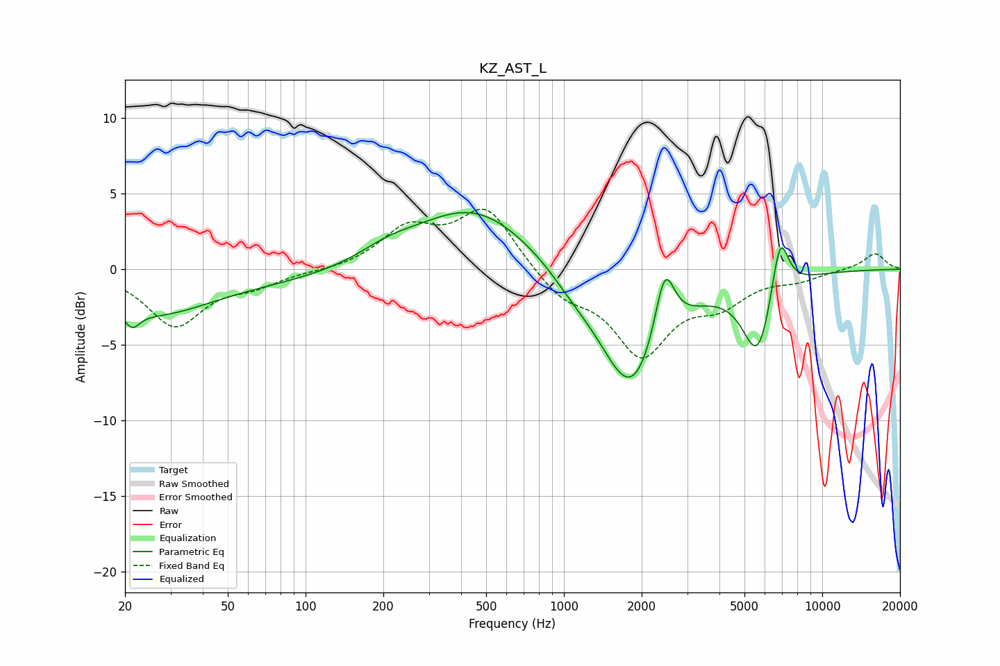

# KZ_AST_L
See [usage instructions](https://github.com/jaakkopasanen/AutoEq#usage) for more options and info.

### Parametric EQs
Apply preamp of -3.8 dB when using parametric equalizer.

|   # | Type    |   Fc (Hz) |    Q |   Gain (dB) |
|-----|---------|-----------|------|-------------|
|   1 | Peaking |        21 | 4.58 |        -1.2 |
|   2 | Peaking |        26 | 0.69 |        -2.4 |
|   3 | Peaking |        74 | 0.28 |        -0.8 |
|   4 | Peaking |       207 | 1.23 |         0.8 |
|   5 | Peaking |       447 | 0.61 |         4.3 |
|   6 | Peaking |      1073 | 1.76 |        -0.6 |
|   7 | Peaking |      1829 | 1.1  |        -8.4 |
|   8 | Peaking |      2454 | 3.59 |         4.8 |
|   9 | Peaking |      5647 | 2.3  |        -5.3 |
|  10 | Peaking |      6859 | 3.99 |         4.3 |

### Fixed Band EQs
When using fixed band (also called graphic) equalizer, apply preamp of **-4.1 dB** (if available) and set gains manually with these parameters.

|   # | Type    |   Fc (Hz) |    Q |   Gain (dB) |
|-----|---------|-----------|------|-------------|
|   1 | Peaking |        31 | 1.41 |        -3.7 |
|   2 | Peaking |        62 | 1.41 |        -0.9 |
|   3 | Peaking |       125 | 1.41 |        -0.1 |
|   4 | Peaking |       250 | 1.41 |         2.5 |
|   5 | Peaking |       500 | 1.41 |         4   |
|   6 | Peaking |      1000 | 1.41 |        -1.7 |
|   7 | Peaking |      2000 | 1.41 |        -5.4 |
|   8 | Peaking |      4000 | 1.41 |        -1.9 |
|   9 | Peaking |      8000 | 1.41 |        -0.6 |
|  10 | Peaking |     16000 | 1.41 |         1.1 |

### Graphs

