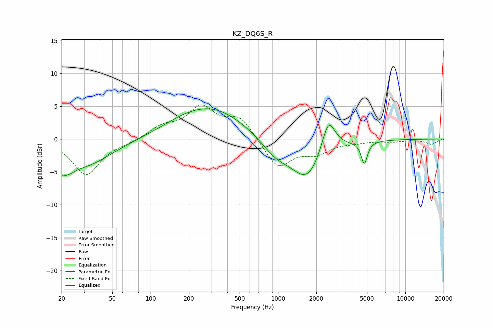

# KZ_DQ6S_R
See [usage instructions](https://github.com/jaakkopasanen/AutoEq#usage) for more options and info.

### Parametric EQs
Apply preamp of -4.7 dB when using parametric equalizer.

|   # | Type    |   Fc (Hz) |    Q |   Gain (dB) |
|-----|---------|-----------|------|-------------|
|   1 | Peaking |        20 | 5.31 |        -4.5 |
|   2 | Peaking |        20 | 6    |         2.8 |
|   3 | Peaking |        23 | 2.77 |        -1.2 |
|   4 | Peaking |        30 | 0.66 |        -4   |
|   5 | Peaking |       172 | 1.01 |         0.4 |
|   6 | Peaking |       296 | 0.52 |         4.8 |
|   7 | Peaking |       955 | 1.2  |        -2.4 |
|   8 | Peaking |      1706 | 1.12 |        -6   |
|   9 | Peaking |      2487 | 2.59 |         5.5 |
|  10 | Peaking |      4758 | 5.89 |        -3.4 |

### Fixed Band EQs
When using fixed band (also called graphic) equalizer, apply preamp of **-5.3 dB** (if available) and set gains manually with these parameters.

|   # | Type    |   Fc (Hz) |    Q |   Gain (dB) |
|-----|---------|-----------|------|-------------|
|   1 | Peaking |        31 | 1.41 |        -5.4 |
|   2 | Peaking |        62 | 1.41 |        -0.4 |
|   3 | Peaking |       125 | 1.41 |         1.7 |
|   4 | Peaking |       250 | 1.41 |         4.5 |
|   5 | Peaking |       500 | 1.41 |         3.2 |
|   6 | Peaking |      1000 | 1.41 |        -4.4 |
|   7 | Peaking |      2000 | 1.41 |        -1.9 |
|   8 | Peaking |      4000 | 1.41 |        -0.3 |
|   9 | Peaking |      8000 | 1.41 |        -0.3 |
|  10 | Peaking |     16000 | 1.41 |        -0.8 |

### Graphs

