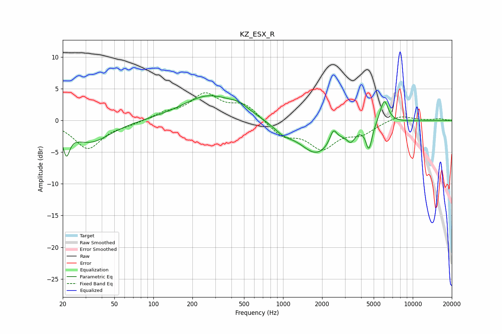

# KZ_ESX_R
See [usage instructions](https://github.com/jaakkopasanen/AutoEq#usage) for more options and info.

### Parametric EQs
Apply preamp of -4.0 dB when using parametric equalizer.

|   # | Type    |   Fc (Hz) |    Q |   Gain (dB) |
|-----|---------|-----------|------|-------------|
|   1 | Peaking |        21 | 5.69 |        -3.6 |
|   2 | Peaking |        33 | 0.91 |        -3.4 |
|   3 | Peaking |       268 | 0.7  |         3.9 |
|   4 | Peaking |       460 | 1.91 |         1   |
|   5 | Peaking |      1001 | 1.91 |        -1.2 |
|   6 | Peaking |      1816 | 1.06 |        -5.1 |
|   7 | Peaking |      2441 | 5.45 |         2.1 |
|   8 | Peaking |      3333 | 4.37 |        -1.8 |
|   9 | Peaking |      4594 | 5.82 |        -3.9 |
|  10 | Peaking |      6019 | 4.34 |         3.7 |

### Fixed Band EQs
When using fixed band (also called graphic) equalizer, apply preamp of **-4.5 dB** (if available) and set gains manually with these parameters.

|   # | Type    |   Fc (Hz) |    Q |   Gain (dB) |
|-----|---------|-----------|------|-------------|
|   1 | Peaking |        31 | 1.41 |        -4.4 |
|   2 | Peaking |        62 | 1.41 |        -0.5 |
|   3 | Peaking |       125 | 1.41 |         1   |
|   4 | Peaking |       250 | 1.41 |         3.9 |
|   5 | Peaking |       500 | 1.41 |         2.4 |
|   6 | Peaking |      1000 | 1.41 |        -2.3 |
|   7 | Peaking |      2000 | 1.41 |        -4.1 |
|   8 | Peaking |      4000 | 1.41 |        -1.8 |
|   9 | Peaking |      8000 | 1.41 |         0.9 |
|  10 | Peaking |     16000 | 1.41 |         0.3 |

### Graphs

