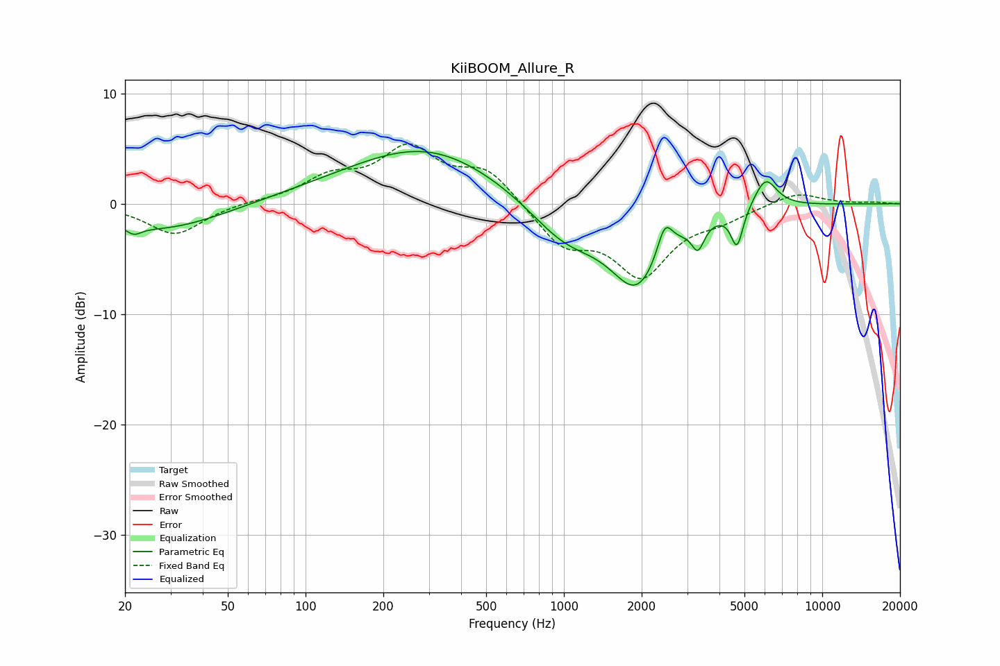

# KiiBOOM_Allure_R
See [usage instructions](https://github.com/jaakkopasanen/AutoEq#usage) for more options and info.

### Parametric EQs
Apply preamp of -4.8 dB when using parametric equalizer.

|   # | Type    |   Fc (Hz) |    Q |   Gain (dB) |
|-----|---------|-----------|------|-------------|
|   1 | Peaking |        22 | 5.07 |        -0.7 |
|   2 | Peaking |        28 | 0.59 |        -2.4 |
|   3 | Peaking |       130 | 0.46 |         0.7 |
|   4 | Peaking |       300 | 0.5  |         4.8 |
|   5 | Peaking |      1008 | 1.01 |        -3.4 |
|   6 | Peaking |      1923 | 1.33 |        -7   |
|   7 | Peaking |      2458 | 4.7  |         3   |
|   8 | Peaking |      3304 | 5.87 |        -2.2 |
|   9 | Peaking |      4680 | 6    |        -3.4 |
|  10 | Peaking |      6027 | 3.09 |         2.7 |

### Fixed Band EQs
When using fixed band (also called graphic) equalizer, apply preamp of **-5.5 dB** (if available) and set gains manually with these parameters.

|   # | Type    |   Fc (Hz) |    Q |   Gain (dB) |
|-----|---------|-----------|------|-------------|
|   1 | Peaking |        31 | 1.41 |        -2.8 |
|   2 | Peaking |        62 | 1.41 |         0.2 |
|   3 | Peaking |       125 | 1.41 |         2.1 |
|   4 | Peaking |       250 | 1.41 |         4.7 |
|   5 | Peaking |       500 | 1.41 |         3   |
|   6 | Peaking |      1000 | 1.41 |        -3.5 |
|   7 | Peaking |      2000 | 1.41 |        -6.1 |
|   8 | Peaking |      4000 | 1.41 |        -1.1 |
|   9 | Peaking |      8000 | 1.41 |         1.1 |
|  10 | Peaking |     16000 | 1.41 |         0.1 |

### Graphs

