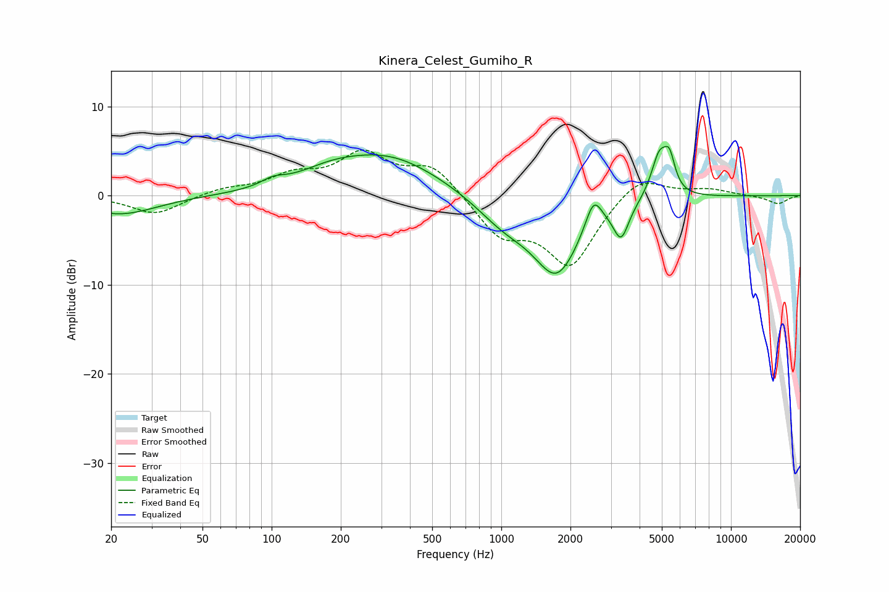

# Kinera_Celest_Gumiho_R
See [usage instructions](https://github.com/jaakkopasanen/AutoEq#usage) for more options and info.

### Parametric EQs
Apply preamp of -5.6 dB when using parametric equalizer.

|   # | Type    |   Fc (Hz) |    Q |   Gain (dB) |
|-----|---------|-----------|------|-------------|
|   1 | Peaking |        22 | 0.89 |        -2.1 |
|   2 | Peaking |       101 | 2.78 |         0.7 |
|   3 | Peaking |       179 | 1    |         1.3 |
|   4 | Peaking |       324 | 0.61 |         4.3 |
|   5 | Peaking |      1027 | 1.12 |        -2.7 |
|   6 | Peaking |      1745 | 1.36 |        -8.3 |
|   7 | Peaking |      2523 | 3.92 |         3.5 |
|   8 | Peaking |      3324 | 4.22 |        -3.7 |
|   9 | Peaking |      4879 | 3.82 |         4.9 |
|  10 | Peaking |      5404 | 5.97 |         3.2 |

### Fixed Band EQs
When using fixed band (also called graphic) equalizer, apply preamp of **-5.2 dB** (if available) and set gains manually with these parameters.

|   # | Type    |   Fc (Hz) |    Q |   Gain (dB) |
|-----|---------|-----------|------|-------------|
|   1 | Peaking |        31 | 1.41 |        -2.1 |
|   2 | Peaking |        62 | 1.41 |         0.7 |
|   3 | Peaking |       125 | 1.41 |         2   |
|   4 | Peaking |       250 | 1.41 |         4.3 |
|   5 | Peaking |       500 | 1.41 |         3.3 |
|   6 | Peaking |      1000 | 1.41 |        -4.2 |
|   7 | Peaking |      2000 | 1.41 |        -7.7 |
|   8 | Peaking |      4000 | 1.41 |         2.6 |
|   9 | Peaking |      8000 | 1.41 |         0.7 |
|  10 | Peaking |     16000 | 1.41 |        -0.9 |

### Graphs

