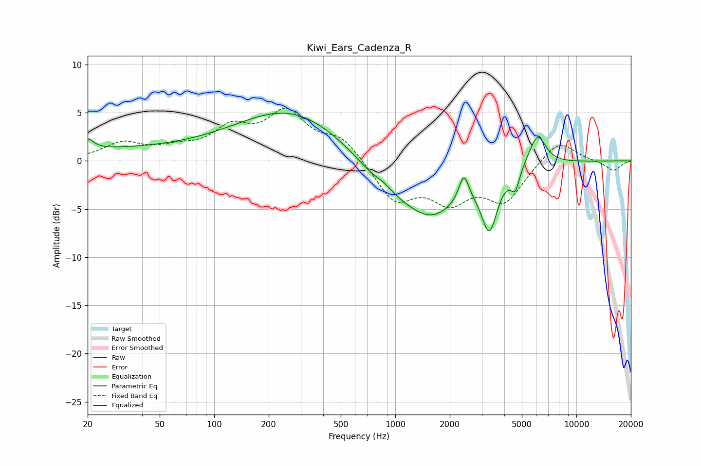

# Kiwi_Ears_Cadenza_R
See [usage instructions](https://github.com/jaakkopasanen/AutoEq#usage) for more options and info.

### Parametric EQs
Apply preamp of -5.0 dB when using parametric equalizer.

|   # | Type    |   Fc (Hz) |    Q |   Gain (dB) |
|-----|---------|-----------|------|-------------|
|   1 | Peaking |        20 | 4.48 |         1.1 |
|   2 | Peaking |        29 | 0.21 |         1.1 |
|   3 | Peaking |       265 | 0.48 |         5.1 |
|   4 | Peaking |       841 | 1.09 |        -1.9 |
|   5 | Peaking |       861 | 2.77 |         0.6 |
|   6 | Peaking |      1574 | 0.81 |        -5.6 |
|   7 | Peaking |      2391 | 5.19 |         2.8 |
|   8 | Peaking |      3309 | 3.26 |        -5.6 |
|   9 | Peaking |      4595 | 6    |        -2   |
|  10 | Peaking |      6086 | 2.93 |         3.3 |

### Fixed Band EQs
When using fixed band (also called graphic) equalizer, apply preamp of **-5.6 dB** (if available) and set gains manually with these parameters.

|   # | Type    |   Fc (Hz) |    Q |   Gain (dB) |
|-----|---------|-----------|------|-------------|
|   1 | Peaking |        31 | 1.41 |         1.7 |
|   2 | Peaking |        62 | 1.41 |         1   |
|   3 | Peaking |       125 | 1.41 |         2.9 |
|   4 | Peaking |       250 | 1.41 |         4.6 |
|   5 | Peaking |       500 | 1.41 |         2.3 |
|   6 | Peaking |      1000 | 1.41 |        -4.1 |
|   7 | Peaking |      2000 | 1.41 |        -3.6 |
|   8 | Peaking |      4000 | 1.41 |        -4   |
|   9 | Peaking |      8000 | 1.41 |         2.3 |
|  10 | Peaking |     16000 | 1.41 |        -1   |

### Graphs

