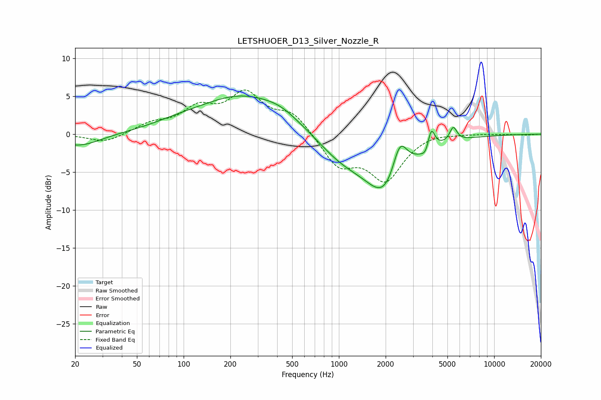

# LETSHUOER_D13_Silver_Nozzle_R
See [usage instructions](https://github.com/jaakkopasanen/AutoEq#usage) for more options and info.

### Parametric EQs
Apply preamp of -5.1 dB when using parametric equalizer.

|   # | Type    |   Fc (Hz) |    Q |   Gain (dB) |
|-----|---------|-----------|------|-------------|
|   1 | Peaking |        21 | 1.03 |        -1.6 |
|   2 | Peaking |        88 | 0.87 |         0.5 |
|   3 | Peaking |       246 | 0.47 |         5.1 |
|   4 | Peaking |       423 | 1.46 |         0.7 |
|   5 | Peaking |      1026 | 0.86 |        -2.7 |
|   6 | Peaking |      2048 | 1.03 |        -8.2 |
|   7 | Peaking |      2463 | 2.74 |         5.6 |
|   8 | Peaking |      3643 | 5.51 |        -1.2 |
|   9 | Peaking |      3926 | 6    |         3.1 |
|  10 | Peaking |      5453 | 6    |         1.9 |

### Fixed Band EQs
When using fixed band (also called graphic) equalizer, apply preamp of **-5.9 dB** (if available) and set gains manually with these parameters.

|   # | Type    |   Fc (Hz) |    Q |   Gain (dB) |
|-----|---------|-----------|------|-------------|
|   1 | Peaking |        31 | 1.41 |        -1.2 |
|   2 | Peaking |        62 | 1.41 |         1.2 |
|   3 | Peaking |       125 | 1.41 |         3   |
|   4 | Peaking |       250 | 1.41 |         4.9 |
|   5 | Peaking |       500 | 1.41 |         2.7 |
|   6 | Peaking |      1000 | 1.41 |        -4   |
|   7 | Peaking |      2000 | 1.41 |        -5.8 |
|   8 | Peaking |      4000 | 1.41 |         0.4 |
|   9 | Peaking |      8000 | 1.41 |         0.1 |
|  10 | Peaking |     16000 | 1.41 |        -0.1 |

### Graphs

