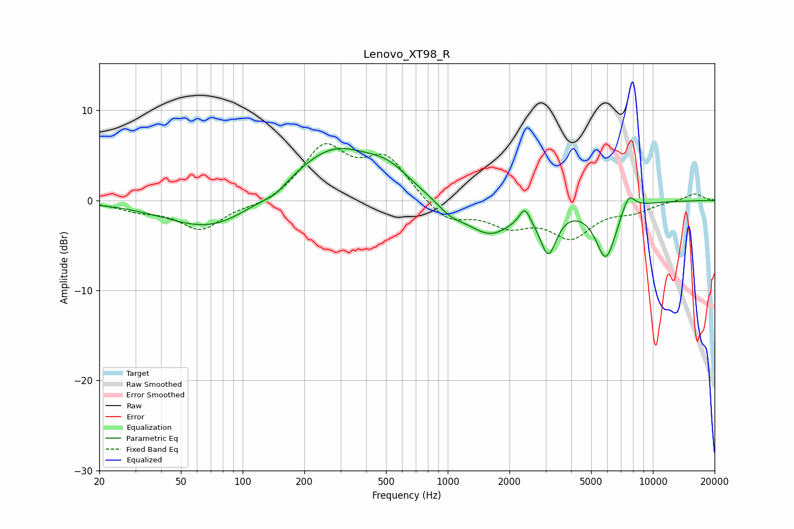

# Lenovo_XT98_R
See [usage instructions](https://github.com/jaakkopasanen/AutoEq#usage) for more options and info.

### Parametric EQs
Apply preamp of -5.9 dB when using parametric equalizer.

|   # | Type    |   Fc (Hz) |    Q |   Gain (dB) |
|-----|---------|-----------|------|-------------|
|   1 | Peaking |        70 | 0.66 |        -3.4 |
|   2 | Peaking |       144 | 2.64 |        -0.7 |
|   3 | Peaking |       278 | 0.68 |         5.9 |
|   4 | Peaking |       512 | 1.43 |         1.7 |
|   5 | Peaking |      1032 | 1.98 |        -1.3 |
|   6 | Peaking |      1603 | 1.25 |        -3.7 |
|   7 | Peaking |      2372 | 5.8  |         1.7 |
|   8 | Peaking |      3094 | 3.56 |        -4.9 |
|   9 | Peaking |      5905 | 2.73 |        -6.2 |
|  10 | Peaking |      7609 | 4.21 |         2   |

### Fixed Band EQs
When using fixed band (also called graphic) equalizer, apply preamp of **-6.4 dB** (if available) and set gains manually with these parameters.

|   # | Type    |   Fc (Hz) |    Q |   Gain (dB) |
|-----|---------|-----------|------|-------------|
|   1 | Peaking |        31 | 1.41 |        -0.9 |
|   2 | Peaking |        62 | 1.41 |        -3.2 |
|   3 | Peaking |       125 | 1.41 |        -0.7 |
|   4 | Peaking |       250 | 1.41 |         5.8 |
|   5 | Peaking |       500 | 1.41 |         4.5 |
|   6 | Peaking |      1000 | 1.41 |        -2.4 |
|   7 | Peaking |      2000 | 1.41 |        -2.4 |
|   8 | Peaking |      4000 | 1.41 |        -3.8 |
|   9 | Peaking |      8000 | 1.41 |        -1   |
|  10 | Peaking |     16000 | 1.41 |         0.8 |

### Graphs

