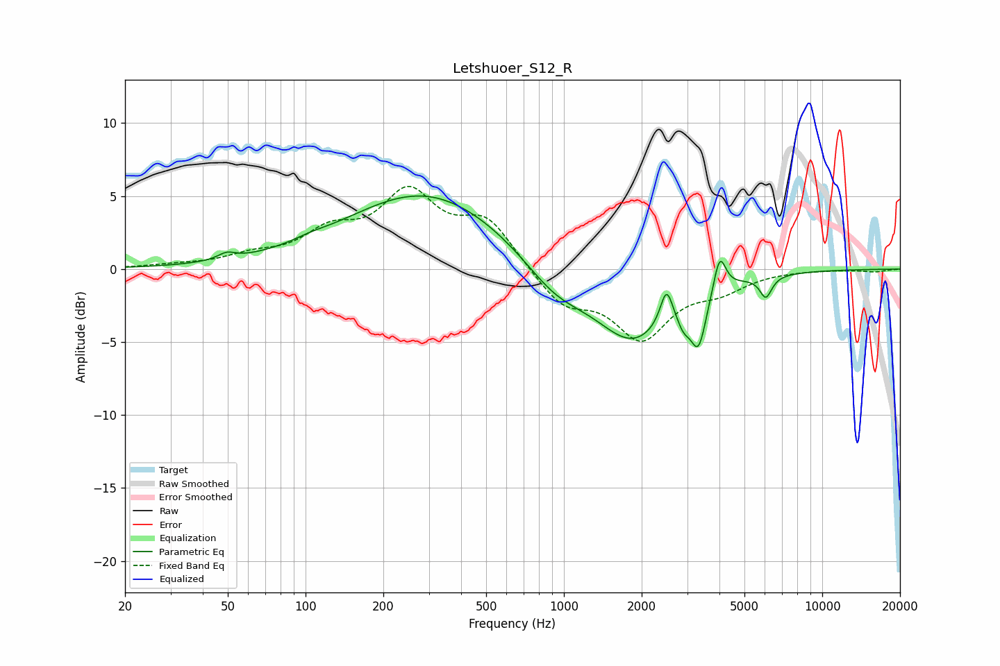

# Letshuoer_S12_R
See [usage instructions](https://github.com/jaakkopasanen/AutoEq#usage) for more options and info.

### Parametric EQs
Apply preamp of -5.1 dB when using parametric equalizer.

|   # | Type    |   Fc (Hz) |    Q |   Gain (dB) |
|-----|---------|-----------|------|-------------|
|   1 | Peaking |        49 | 4.33 |         0.4 |
|   2 | Peaking |       104 | 2.31 |         0.2 |
|   3 | Peaking |       293 | 0.46 |         5.3 |
|   4 | Peaking |       926 | 1.12 |        -2.1 |
|   5 | Peaking |      1853 | 0.96 |        -4.9 |
|   6 | Peaking |      2495 | 6    |         2.4 |
|   7 | Peaking |      2904 | 5.79 |        -1.1 |
|   8 | Peaking |      3318 | 4.65 |        -3.6 |
|   9 | Peaking |      4008 | 6    |         2.6 |
|  10 | Peaking |      6048 | 6    |        -1.5 |

### Fixed Band EQs
When using fixed band (also called graphic) equalizer, apply preamp of **-5.8 dB** (if available) and set gains manually with these parameters.

|   # | Type    |   Fc (Hz) |    Q |   Gain (dB) |
|-----|---------|-----------|------|-------------|
|   1 | Peaking |        31 | 1.41 |         0.2 |
|   2 | Peaking |        62 | 1.41 |         0.7 |
|   3 | Peaking |       125 | 1.41 |         2.2 |
|   4 | Peaking |       250 | 1.41 |         4.8 |
|   5 | Peaking |       500 | 1.41 |         3.1 |
|   6 | Peaking |      1000 | 1.41 |        -2.4 |
|   7 | Peaking |      2000 | 1.41 |        -4.5 |
|   8 | Peaking |      4000 | 1.41 |        -1.2 |
|   9 | Peaking |      8000 | 1.41 |         0   |
|  10 | Peaking |     16000 | 1.41 |        -0.2 |

### Graphs

