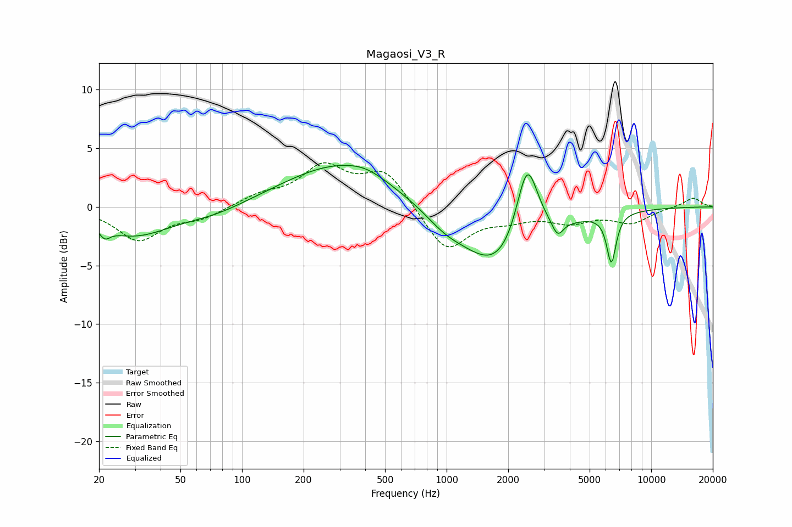

# Magaosi_V3_R
See [usage instructions](https://github.com/jaakkopasanen/AutoEq#usage) for more options and info.

### Parametric EQs
Apply preamp of -3.6 dB when using parametric equalizer.

|   # | Type    |   Fc (Hz) |    Q |   Gain (dB) |
|-----|---------|-----------|------|-------------|
|   1 | Peaking |        21 | 5.68 |        -0.8 |
|   2 | Peaking |        30 | 0.78 |        -2.4 |
|   3 | Peaking |        74 | 0.91 |        -0.7 |
|   4 | Peaking |       302 | 0.52 |         3.7 |
|   5 | Peaking |       404 | 1.58 |         0.5 |
|   6 | Peaking |       976 | 1.55 |        -0.9 |
|   7 | Peaking |      1851 | 0.76 |        -5.9 |
|   8 | Peaking |      2473 | 2.49 |         7.6 |
|   9 | Peaking |      3487 | 5.3  |        -1.3 |
|  10 | Peaking |      6389 | 6    |        -4.2 |

### Fixed Band EQs
When using fixed band (also called graphic) equalizer, apply preamp of **-3.9 dB** (if available) and set gains manually with these parameters.

|   # | Type    |   Fc (Hz) |    Q |   Gain (dB) |
|-----|---------|-----------|------|-------------|
|   1 | Peaking |        31 | 1.41 |        -2.8 |
|   2 | Peaking |        62 | 1.41 |        -0.9 |
|   3 | Peaking |       125 | 1.41 |         0.9 |
|   4 | Peaking |       250 | 1.41 |         3.2 |
|   5 | Peaking |       500 | 1.41 |         3   |
|   6 | Peaking |      1000 | 1.41 |        -3.9 |
|   7 | Peaking |      2000 | 1.41 |        -0.8 |
|   8 | Peaking |      4000 | 1.41 |        -1.2 |
|   9 | Peaking |      8000 | 1.41 |        -1.3 |
|  10 | Peaking |     16000 | 1.41 |         0.8 |

### Graphs

