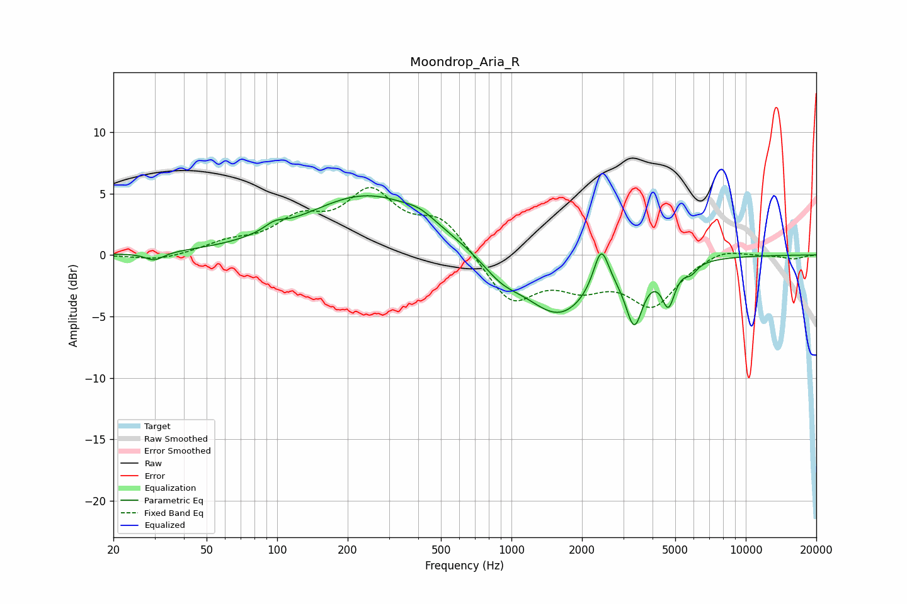

# Moondrop_Aria_R
See [usage instructions](https://github.com/jaakkopasanen/AutoEq#usage) for more options and info.

### Parametric EQs
Apply preamp of -4.9 dB when using parametric equalizer.

|   # | Type    |   Fc (Hz) |    Q |   Gain (dB) |
|-----|---------|-----------|------|-------------|
|   1 | Peaking |        30 | 3.67 |        -0.7 |
|   2 | Peaking |        97 | 3.34 |         0.6 |
|   3 | Peaking |       245 | 0.52 |         4.9 |
|   4 | Peaking |       407 | 2.24 |         0.6 |
|   5 | Peaking |       904 | 1.63 |        -1.4 |
|   6 | Peaking |      1599 | 0.95 |        -4.9 |
|   7 | Peaking |      2416 | 4.33 |         3.5 |
|   8 | Peaking |      3344 | 3.95 |        -4.4 |
|   9 | Peaking |      4676 | 4.97 |        -3.1 |
|  10 | Peaking |      5838 | 5.16 |        -0.7 |

### Fixed Band EQs
When using fixed band (also called graphic) equalizer, apply preamp of **-5.6 dB** (if available) and set gains manually with these parameters.

|   # | Type    |   Fc (Hz) |    Q |   Gain (dB) |
|-----|---------|-----------|------|-------------|
|   1 | Peaking |        31 | 1.41 |        -0.5 |
|   2 | Peaking |        62 | 1.41 |         0.8 |
|   3 | Peaking |       125 | 1.41 |         2.5 |
|   4 | Peaking |       250 | 1.41 |         4.7 |
|   5 | Peaking |       500 | 1.41 |         2.8 |
|   6 | Peaking |      1000 | 1.41 |        -3.9 |
|   7 | Peaking |      2000 | 1.41 |        -2   |
|   8 | Peaking |      4000 | 1.41 |        -3.9 |
|   9 | Peaking |      8000 | 1.41 |         0.7 |
|  10 | Peaking |     16000 | 1.41 |        -0.3 |

### Graphs

