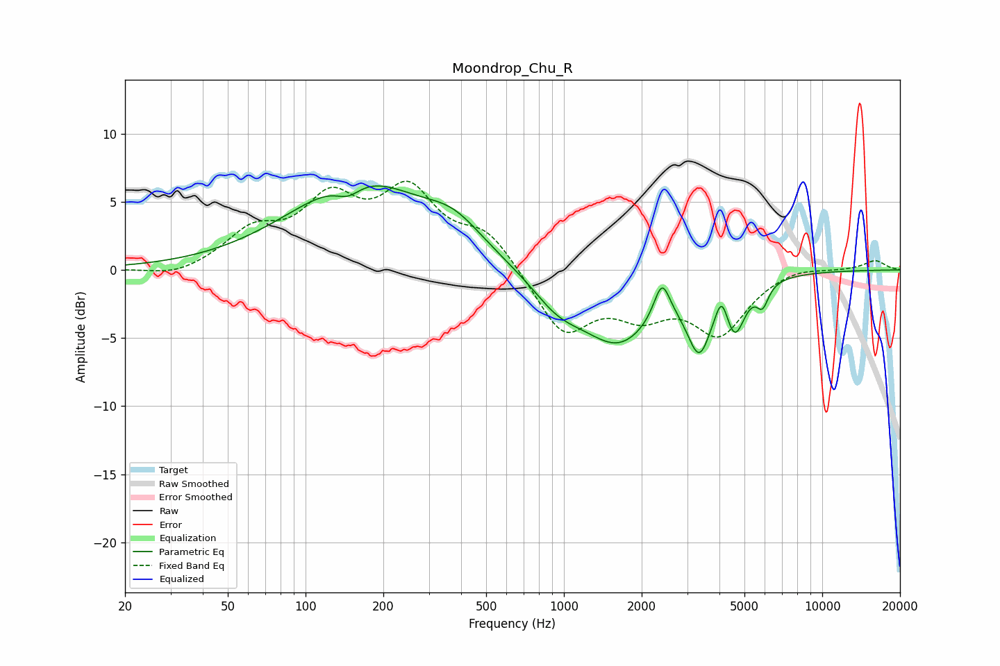

# Moondrop_Chu_R
See [usage instructions](https://github.com/jaakkopasanen/AutoEq#usage) for more options and info.

### Parametric EQs
Apply preamp of -6.3 dB when using parametric equalizer.

|   # | Type    |   Fc (Hz) |    Q |   Gain (dB) |
|-----|---------|-----------|------|-------------|
|   1 | Peaking |       146 | 2.86 |        -1   |
|   2 | Peaking |       162 | 0.53 |         6.4 |
|   3 | Peaking |       376 | 1.29 |         1.8 |
|   4 | Peaking |       946 | 1.38 |        -2   |
|   5 | Peaking |      1631 | 0.97 |        -5   |
|   6 | Peaking |      2396 | 4.54 |         2.8 |
|   7 | Peaking |      3342 | 3.05 |        -4.5 |
|   8 | Peaking |      4082 | 6    |         1.9 |
|   9 | Peaking |      4593 | 3.62 |        -3.5 |
|  10 | Peaking |      5876 | 6    |        -1.6 |

### Fixed Band EQs
When using fixed band (also called graphic) equalizer, apply preamp of **-6.6 dB** (if available) and set gains manually with these parameters.

|   # | Type    |   Fc (Hz) |    Q |   Gain (dB) |
|-----|---------|-----------|------|-------------|
|   1 | Peaking |        31 | 1.41 |        -0.6 |
|   2 | Peaking |        62 | 1.41 |         2.5 |
|   3 | Peaking |       125 | 1.41 |         4.6 |
|   4 | Peaking |       250 | 1.41 |         5.3 |
|   5 | Peaking |       500 | 1.41 |         2.6 |
|   6 | Peaking |      1000 | 1.41 |        -4.6 |
|   7 | Peaking |      2000 | 1.41 |        -2.6 |
|   8 | Peaking |      4000 | 1.41 |        -4.4 |
|   9 | Peaking |      8000 | 1.41 |         0.4 |
|  10 | Peaking |     16000 | 1.41 |         0.7 |

### Graphs

