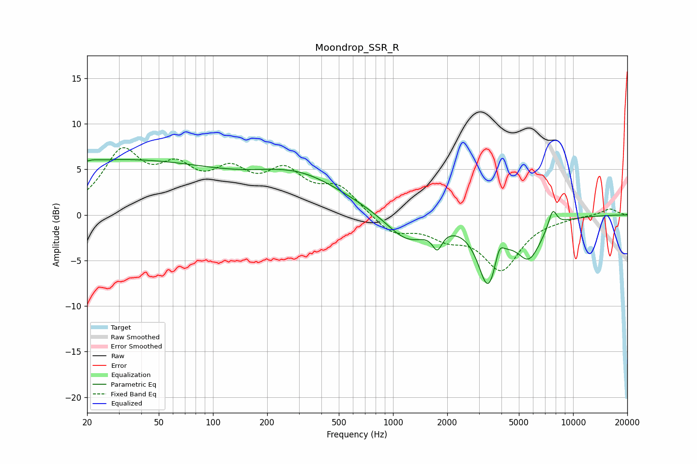

# Moondrop_SSR_R
See [usage instructions](https://github.com/jaakkopasanen/AutoEq#usage) for more options and info.

### Parametric EQs
Apply preamp of -6.2 dB when using parametric equalizer.

|   # | Type    |   Fc (Hz) |    Q |   Gain (dB) |
|-----|---------|-----------|------|-------------|
|   1 | Peaking |        22 | 5.7  |         0.1 |
|   2 | Peaking |        28 | 0.21 |         5.9 |
|   3 | Peaking |       301 | 0.55 |         3.8 |
|   4 | Peaking |      1201 | 1.2  |        -3.1 |
|   5 | Peaking |      1761 | 5.32 |        -2   |
|   6 | Peaking |      3390 | 2.59 |        -7.7 |
|   7 | Peaking |      3447 | 4.21 |         0.6 |
|   8 | Peaking |      3886 | 5.68 |         2   |
|   9 | Peaking |      5690 | 1.97 |        -4.1 |
|  10 | Peaking |      7703 | 5.71 |         2   |

### Fixed Band EQs
When using fixed band (also called graphic) equalizer, apply preamp of **-7.5 dB** (if available) and set gains manually with these parameters.

|   # | Type    |   Fc (Hz) |    Q |   Gain (dB) |
|-----|---------|-----------|------|-------------|
|   1 | Peaking |        31 | 1.41 |         6.4 |
|   2 | Peaking |        62 | 1.41 |         4   |
|   3 | Peaking |       125 | 1.41 |         3.8 |
|   4 | Peaking |       250 | 1.41 |         4.1 |
|   5 | Peaking |       500 | 1.41 |         2.8 |
|   6 | Peaking |      1000 | 1.41 |        -2   |
|   7 | Peaking |      2000 | 1.41 |        -1.9 |
|   8 | Peaking |      4000 | 1.41 |        -5.7 |
|   9 | Peaking |      8000 | 1.41 |        -0.2 |
|  10 | Peaking |     16000 | 1.41 |         0.7 |

### Graphs

